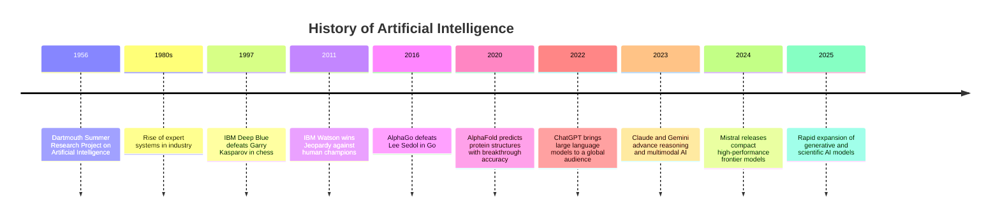

# History of Artificial Intelligence

## The Birth of Artificial Intelligence (1956)

- Dartmouth Summer Research Project on Artificial Intelligence
- John McCarthy, Marvin Minsky, Claude Shannon, Nathaniel Rochester
- AI becomes a formal academic field
- The idea: machines can reason and solve problems

> This slide sets the origin story. Emphasize how bold the idea felt in 1956. Mention that the Dartmouth meeting defined AI as a real discipline rather than speculation.

## Early Progress and Expert Systems

- Early programs prove theorems and solve symbolic problems
- Researchers pursue logic and rule-based reasoning
- Expert systems rise in the 1980s
- Organizations use AI for diagnostics, finance, and engineering

> Explain how symbolic AI worked. Highlight that expert systems encoded human rules rather than learning from data. Note that commercial adoption begins here.

## IBM Deep Blue Defeats Garry Kasparov (1997)

- IBM Deep Blue beats the world chess champion
- The match proves machine strength in strategy
- Search, evaluation, and computation drive the result
- Public perception of AI changes

> Describe the cultural reaction. Stress that chess had long been a benchmark for intelligence. Frame this as a moment when AI moved from labs into headlines.

## IBM Watson Wins Jeopardy (2011)

- IBM Watson competes against top Jeopardy champions
- The system parses questions in natural language
- Watson retrieves evidence and ranks answers
- AI shows progress in language and knowledge domains

> Explain why Jeopardy is difficult. Humans infer meaning from puns and ambiguity. Emphasize the leap from structured tasks to messy language.

## AlphaGo Defeats Lee Sedol (2016)

- DeepMind AlphaGo defeats Go world champion Lee Sedol
- Go has an enormous search space and subtle strategy
- Neural networks and reinforcement learning enable play
- The world sees a new form of machine learning ability

> Share how experts thought Go would take decades. Explain move 37 as a symbolic moment. Stress that learning patterns replaced hand-coded logic.

## AlphaFold and the Protein Breakthrough (2020–2021)

- AlphaFold predicts protein structures with high accuracy
- Biology research accelerates
- Drug discovery gains new tools
- AI shifts into scientific discovery

> Explain how protein folding had challenged scientists for fifty years. Stress that AI produced knowledge with real scientific impact, not only competition wins.

## The Transition Toward Generative AI

- AI moves from prediction to creation
- Models produce text, images, audio, and code
- Research and industry accelerate progress together
- Public access expands the scale of experimentation

> Highlight how generative AI feels different. People interact with it daily. This marks a social, creative, and economic shift.

## Foundation Models and Rapid Iteration (2022–2025)

- ChatGPT introduces large-scale conversational models
- GPT-4 improves reasoning and reliability
- Claude expands context and safety focus
- Gemini advances multimodal capability
- Mistral delivers compact, efficient frontier models
- Multiple releases arrive within three years

> Emphasize pace. Contrast decades-long gaps in earlier milestones with rapid iteration today. Explain that model scale, data, and compute drive this curve.

## The Present Moment

- AI shapes science, business, education, and creativity
- Progress spreads across language, images, biology, and robotics
- Agents and tools broaden real-world applications
- The field builds on decades of milestones

> Close with continuity. The story links pioneers, competitions, science, and generative models. Frame the present as part of a long arc.

## Timeline of AI Milestones

> Use this slide as a visual anchor. Walk from left to right. Reinforce how progress accelerates over time.
