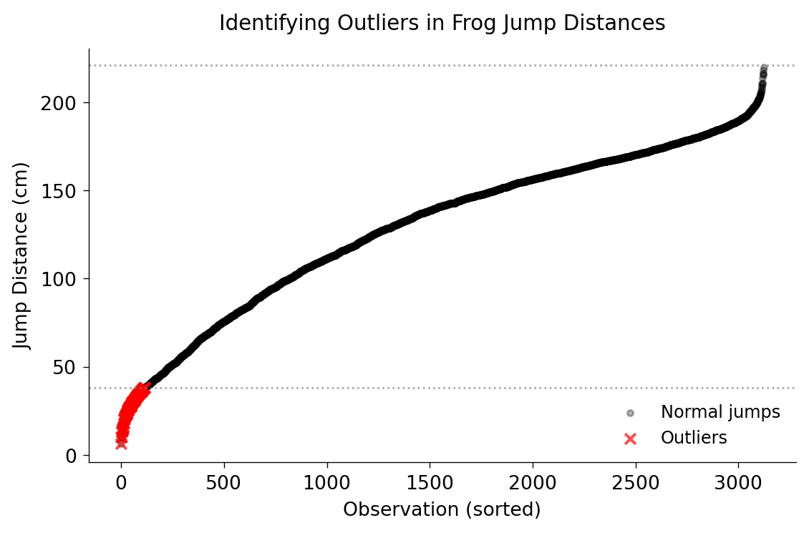

# Week 2 — Data and Learning
Focus: supervised vs unsupervised  
Simple classifier via API or scikit-learn

> This week focuses on the fundamentals of machine learning: how computers learn from data. You'll train your first classifier and learn to evaluate its performance using standard metrics.
---

## Recap and Goals
Build intuition by training a tiny classifier

> We'll build practical intuition by working hands-on with a simple classifier. The goal is to understand the learning process by doing it yourself rather than just reading about it.
---

## Data Basics
Features (X) and labels (y)  
Tabular focus

> In machine learning, data is organized into features (the characteristics we measure, called X) and labels (the outcomes we're trying to predict, called y). Think of features as the inputs and labels as the correct answers we're trying to learn.
---

## Supervised Learning
Train with labeled examples to predict targets

> Supervised learning is like learning with a teacher - you have examples with correct answers (labels) and learn to predict those answers for new examples. This is the most common type of machine learning and powers most real-world AI applications.
---

## Unsupervised Learning
Discover structure without labels (clustering)

> Unsupervised learning works without labels - the algorithm must find patterns or groupings in the data on its own. This is useful for discovering natural categories in your data, like finding customer segments or identifying unusual patterns.
---

## Train/Val/Test Split
Holdout to estimate generalization

> We split data into training (to learn patterns), validation (to tune settings), and test (to evaluate final performance). This split is crucial because testing on data the model has already seen would give falsely optimistic results.
---

## Baseline First
Majority class or simple rule

> Always start with a simple baseline like predicting the most common outcome. This gives you a performance floor - your complex model should beat this or there's no point in the added complexity.
---

## Simple Models
Logistic regression, kNN, decision tree

> We'll start with simple, interpretable models: logistic regression (linear boundaries), k-Nearest Neighbors (voting by similarity), and decision trees (yes/no questions). These are easier to understand and often work surprisingly well.
---

## Overfitting vs Underfitting
Bias-variance  
Complexity control

> Overfitting happens when your model memorizes training data instead of learning general patterns - like a student who memorizes answers but doesn't understand concepts. Underfitting is the opposite - the model is too simple to capture important patterns.
---

## Feature Scaling
Standardization for distance-based models

> Some algorithms like k-Nearest Neighbors care about the scale of features (is age in years or decades?). Standardization puts all features on the same scale so one doesn't dominate just because of its units.
---

## Metrics for Classification
Accuracy, precision, recall, F1

> Different metrics measure different aspects of performance. Accuracy is overall correctness, precision is 'when I predict yes, am I usually right?', recall is 'do I find most of the yes cases?', and F1 balances both.
---

## Confusion Matrix
TP/FP/TN/FN interpretation

> A confusion matrix breaks down predictions into True Positives (correctly predicted yes), False Positives (predicted yes but wrong), True Negatives (correctly predicted no), and False Negatives (predicted no but wrong). This helps you understand exactly how your model fails.
---

## API-based Classifier Demo
Send features to an API  
Get prediction

> Modern machine learning often uses APIs where you send data and get predictions back, without needing to understand the internal algorithms. This demo shows how easy it can be to deploy AI without building everything from scratch.
---

## scikit-learn Pipeline Demo
Fit/transform + model  
Reproducible workflow

> Scikit-learn pipelines chain preprocessing steps (like scaling) with your model, ensuring that everything happens in the right order and can be easily reproduced. This prevents common mistakes and makes your work shareable.
---

## Cross-Validation
K-fold to reduce variance in estimates

> Cross-validation trains and tests your model multiple times on different data splits, then averages the results. This gives a more reliable estimate of performance than a single train/test split that might just get lucky.
---

## Class Imbalance
Stratification  
Class weights  
Resampling

> When one class is much more common than another (like fraud detection where fraud is rare), special techniques are needed. Otherwise your model might just predict 'not fraud' all the time and still get high accuracy.
---

## Data Leakage
Keep test data untouched until final eval

> Data leakage occurs when information from your test set accidentally influences training, making performance look better than it really is. The most common mistake is preprocessing on all data before splitting - always split first!
---

## Explainability Lite
Feature importance for trees/logistic

> Some models naturally show which features were most important for their predictions. This helps you understand what the model learned and builds trust by showing that it's using sensible information.
---

## Error Analysis
Inspect misclassifications  
Iterate

> Error analysis means looking at the specific cases your model got wrong to find patterns. Maybe it struggles with certain types of examples - this insight guides improvements to features or training data.
---

## Model Selection
Compare few models  
Pick simplest that works

> Try a few different model types, then choose the simplest one that works well enough. Simpler models are easier to explain, faster to run, and less likely to break in unexpected ways.
---

## Practical Constraints
Data availability, latency, privacy

> Real-world ML must account for practical constraints: is enough data available? How fast must predictions be? Can you use sensitive personal information? These factors often matter more than theoretical performance.
---

## Lab Preview
Train a small classifier with metrics report

> You'll train a classifier on a small dataset and report standard metrics. This hands-on experience will cement the concepts from lecture and give you confidence to tackle larger projects.
---

## Reflection Prompt
What metric aligns with your use-case and why?

> Different applications require different metrics. For medical diagnosis you might care most about recall (finding all sick patients), while for spam filtering precision might matter more (avoid blocking real emails). Think about the costs of different types of errors in your specific use case.
---

## Data Collection Checklist
Define target, scope, inclusion/exclusion  
Document assumptions

> Before building a model, clearly define what you're predicting, what data you'll use, what's included and excluded, and what assumptions you're making. Writing this down prevents mission creep and helps others understand your work.
---

## Feature Types
Numeric, categorical, ordinal, text  
Encoding choices

> Data comes in different types requiring different handling: numeric (actual numbers), categorical (distinct groups like colors), ordinal (ordered categories like ratings), and text (requires special processing). Each type needs appropriate encoding for machine learning.
---

## Quick EDA
Distributions, missingness, correlations, leakage signals

> Exploratory Data Analysis (EDA) means looking at your data before modeling: check distributions for outliers, find missing values, examine correlations between features, and look for signs of data leakage. This often reveals issues that would ruin your model.
---

## Decision Boundaries (Intuition)
Visualize kNN vs logistic vs tree on toy data

> Different models create different types of boundaries between classes. Visualizing these on simple examples helps build intuition about which models work well for which types of problems.
---

## ROC vs PR Curves
Use PR when positives are rare

> ROC curves work well for balanced datasets, but Precision-Recall (PR) curves are better when one class is rare. If you're looking for a needle in a haystack (like fraud), PR curves give more useful information.
---

## Threshold Tuning
Pick threshold for business utility, not default 0.5

> The default threshold of 0.5 probability rarely makes sense for real applications. Instead, tune this threshold based on your business costs - is a false alarm or a miss more expensive?
---

## Probability Calibration
Platt scaling / Isotonic for calibrated outputs

> Raw probabilities from many models aren't well-calibrated - a prediction of 70% confidence might actually be right only 50% of the time. Calibration methods fix this, which matters when you need reliable uncertainty estimates.
---

## Common Leakage Examples
Post-event features  
Target encoded before split

> Common leakage mistakes include using features that won't be available at prediction time, or using information from after the event you're predicting. Always ask: 'Would I actually know this information when making a real prediction?'
---

## Pipeline Anti-patterns
Fit scaler on full data  
Test set peeking

> Never fit preprocessing (like scaling) on all your data before splitting - this leaks information from the test set into training. Always split first, then fit preprocessing only on training data and apply it to test data.
---

## Mini-Activity
Write confusion costs for your use-case (FP vs FN)

> Write down the costs of false positives versus false negatives for your specific application. In fraud detection, missing fraud might cost thousands while false alarms just annoy customers. This analysis guides your threshold choice.
---

## Reading List
Scikit-learn guide (model evaluation)  
Bishop PRML ch.1–2

> The assigned readings provide detailed guidance on model evaluation in scikit-learn and cover the mathematical foundations. These materials complement the practical focus of our labs.
---

## Assignment Brief
Train 2 models  
Compare with ROC/PR  
Justify threshold

> Your assignment requires training two different models, comparing them with proper evaluation curves, and justifying your threshold choice based on business considerations. This exercise brings together all the concepts from this week.