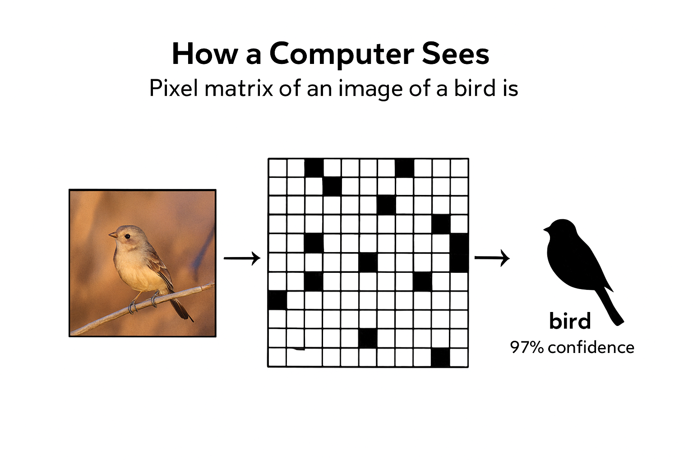

# Lecture 4
# Vision and Images

> This slide covers an important concept in applied AI. Understanding this material will help you evaluate opportunities and challenges when considering AI applications in your field.
---

## Why Vision Works

Images contain structure  
Structure enables learning  
Vision models exploit that structure

> This slide covers an important concept in applied AI. Understanding this material will help you evaluate opportunities and challenges when considering AI applications in your field.
---

## Vision Feels Different From Text

Images follow spatial rules  
Pixels relate by position  
Neighbors matter

> This slide covers an important concept in applied AI. Understanding this material will help you evaluate opportunities and challenges when considering AI applications in your field.
---

## Human Vision as Analogy

Humans detect edges first  
Shapes emerge next  
Objects appear last

> This slide covers an important concept in applied AI. Understanding this material will help you evaluate opportunities and challenges when considering AI applications in your field.
---

## Why This Matters for Models

Models learn patterns hierarchically  
Simple features combine into complex ones  
Structure guides learning

> This slide covers an important concept in applied AI. Understanding this material will help you evaluate opportunities and challenges when considering AI applications in your field.
---

## Spatial Consistency

Objects appear anywhere in an image  
Meaning stays constant across location  
Models must recognize this invariance

> This slide covers an important concept in applied AI. Understanding this material will help you evaluate opportunities and challenges when considering AI applications in your field.
---

## Translation Invariance

A cat remains a cat anywhere  
Position should not change meaning  
Vision models encode this idea

> This slide covers an important concept in applied AI. Understanding this material will help you evaluate opportunities and challenges when considering AI applications in your field.
---

## Local Patterns

Edges appear locally  
Textures repeat locally  
Locality reduces complexity

> This slide covers an important concept in applied AI. Understanding this material will help you evaluate opportunities and challenges when considering AI applications in your field.
---

## Why Fully Connected Models Fail

Pixels explode in number  
Connections grow too fast  
Structure gets ignored

> This slide covers an important concept in applied AI. Understanding this material will help you evaluate opportunities and challenges when considering AI applications in your field.
---

## Inductive Bias

Models assume certain structure  
Bias guides learning  
Correct bias improves performance

> This slide covers an important concept in applied AI. Understanding this material will help you evaluate opportunities and challenges when considering AI applications in your field.
---

## Vision Biases That Help

Nearby pixels relate  
Patterns repeat  
Hierarchy exists

> This slide covers an important concept in applied AI. Understanding this material will help you evaluate opportunities and challenges when considering AI applications in your field.
---

## Natural Images Share Statistics

Edges dominate  
Smooth regions appear often  
Noise follows patterns

> This slide covers an important concept in applied AI. Understanding this material will help you evaluate opportunities and challenges when considering AI applications in your field.
---

## Why Data Efficiency Improves

Structure reduces parameters  
Fewer examples suffice  
Generalization improves

> This slide covers an important concept in applied AI. Understanding this material will help you evaluate opportunities and challenges when considering AI applications in your field.
---

## Vision Versus Tabular Data

Tabular data lacks spatial order  
Images encode geometry  
Models exploit geometry

> This slide covers an important concept in applied AI. Understanding this material will help you evaluate opportunities and challenges when considering AI applications in your field.
---

## Vision Versus Text

Text order matters linearly  
Images order matters spatially  
Different models suit each

> This slide covers an important concept in applied AI. Understanding this material will help you evaluate opportunities and challenges when considering AI applications in your field.
---

## Convolution Intuition

Small filters slide across images  
Filters detect patterns  
Patterns combine

> This slide covers an important concept in applied AI. Understanding this material will help you evaluate opportunities and challenges when considering AI applications in your field.
---

## Why Sliding Matters

Same pattern appears many places  
Shared weights reduce learning burden  
Consistency improves robustness

> This slide covers an important concept in applied AI. Understanding this material will help you evaluate opportunities and challenges when considering AI applications in your field.
---

## Hierarchical Feature Learning

Edges combine into shapes  
Shapes combine into objects  
Objects define scenes

> This slide covers an important concept in applied AI. Understanding this material will help you evaluate opportunities and challenges when considering AI applications in your field.
---

## What Vision Models Learn First

Contrast boundaries  
Orientation  
Simple textures

> This slide covers an important concept in applied AI. Understanding this material will help you evaluate opportunities and challenges when considering AI applications in your field.
---

## What They Learn Later

Parts of objects  
Whole objects  
Contextual cues

> This slide covers an important concept in applied AI. Understanding this material will help you evaluate opportunities and challenges when considering AI applications in your field.
---

## Scale and Resolution

Higher resolution adds detail  
Detail adds cost  
Tradeoffs define design

> This slide covers an important concept in applied AI. Understanding this material will help you evaluate opportunities and challenges when considering AI applications in your field.
---

## Why Vision Became Practical Recently

Large datasets emerged  
Compute became affordable  
Algorithms matured

> This hands-on exercise gives you practical experience with the concepts we've discussed. Working through examples yourself builds intuition that lectures alone can't provide.
---

## Practical Impact

Vision enables automation  
Quality control improves  
Monitoring scales

> This hands-on exercise gives you practical experience with the concepts we've discussed. Working through examples yourself builds intuition that lectures alone can't provide.
---

## Risks Unique to Vision

Surveillance expands  
Bias embeds visually  
Errors feel intrusive

> This slide covers an important concept in applied AI. Understanding this material will help you evaluate opportunities and challenges when considering AI applications in your field.
---

## Applied Lesson

Vision works due to structure  
Structure guides model choice  
Understanding prevents misuse

> This slide covers an important concept in applied AI. Understanding this material will help you evaluate opportunities and challenges when considering AI applications in your field.
---

## Transition to Images as Data

Vision starts with pixels  
Pixels become arrays  
Next we examine images as data

> This slide covers an important concept in applied AI. Understanding this material will help you evaluate opportunities and challenges when considering AI applications in your field.
---

## Images as Data

Models do not see images  
Models see numbers  
Understanding this matters

> This slide covers an important concept in applied AI. Understanding this material will help you evaluate opportunities and challenges when considering AI applications in your field.
---

## What an Image Is

An image is a grid  
Each cell stores a value  
Values represent intensity

> This slide covers an important concept in applied AI. Understanding this material will help you evaluate opportunities and challenges when considering AI applications in your field.
---

## Pixels

Pixels form the smallest unit  
Each pixel holds information  
Arrangement creates structure

> This slide covers an important concept in applied AI. Understanding this material will help you evaluate opportunities and challenges when considering AI applications in your field.
---

## Image Dimensions

Width defines columns  
Height defines rows  
Depth defines channels

> This slide covers an important concept in applied AI. Understanding this material will help you evaluate opportunities and challenges when considering AI applications in your field.
---

## Grayscale Images

One channel exists  
Values represent brightness  
Range reflects intensity

> This slide covers an important concept in applied AI. Understanding this material will help you evaluate opportunities and challenges when considering AI applications in your field.
---

## Color Images

Multiple channels exist  
Red green and blue dominate  
Channels combine to form color

> This slide covers an important concept in applied AI. Understanding this material will help you evaluate opportunities and challenges when considering AI applications in your field.
---

## RGB Representation

Each pixel stores three values  
Each value ranges by scale  
Combination defines color

> This slide covers an important concept in applied AI. Understanding this material will help you evaluate opportunities and challenges when considering AI applications in your field.
---

## Numeric Ranges

Values may range from zero to one  
Values may range from zero to two fifty five  
Consistency matters

> This slide covers an important concept in applied AI. Understanding this material will help you evaluate opportunities and challenges when considering AI applications in your field.
---

## Why Scaling Matters

Large values dominate gradients  
Scaling stabilizes learning  
Normalization improves convergence

> This slide covers an important concept in applied AI. Understanding this material will help you evaluate opportunities and challenges when considering AI applications in your field.
---

## Image as Matrix

Rows represent height  
Columns represent width  
Matrices enable math

> This slide covers an important concept in applied AI. Understanding this material will help you evaluate opportunities and challenges when considering AI applications in your field.
---

## Stacking Channels

Channels stack depth wise  
Arrays become three dimensional  
Shape defines structure

> This slide covers an important concept in applied AI. Understanding this material will help you evaluate opportunities and challenges when considering AI applications in your field.
---

## Image Resolution

Resolution controls detail  
Higher resolution reveals features  
Higher resolution raises cost

> This slide covers an important concept in applied AI. Understanding this material will help you evaluate opportunities and challenges when considering AI applications in your field.
---

## Resizing Images

Models require consistent shape  
Resizing enforces uniformity  
Tradeoffs affect detail

> This slide covers an important concept in applied AI. Understanding this material will help you evaluate opportunities and challenges when considering AI applications in your field.
---

## Aspect Ratio

Stretching distorts objects  
Cropping removes content  
Choices affect meaning

> This slide covers an important concept in applied AI. Understanding this material will help you evaluate opportunities and challenges when considering AI applications in your field.
---

## Image Compression

Compression reduces size  
Lossy compression removes detail  
Artifacts influence learning

> This slide covers an important concept in applied AI. Understanding this material will help you evaluate opportunities and challenges when considering AI applications in your field.
---

## Noise in Images

Sensors introduce noise  
Lighting varies  
Motion blurs edges

> This slide covers an important concept in applied AI. Understanding this material will help you evaluate opportunities and challenges when considering AI applications in your field.
---

## Data Augmentation Intuition

Artificial variation expands data  
Models generalize better  
Realism matters

> Data augmentation artificially expands training sets through transformations like rotations, flips, and color adjustments. This helps models generalize by seeing variations of each example.
---

## Common Augmentations

Rotation changes orientation  
Flipping mirrors objects  
Brightness shifts illumination

> This slide covers an important concept in applied AI. Understanding this material will help you evaluate opportunities and challenges when considering AI applications in your field.
---

## When Augmentation Helps

Small datasets benefit most  
Invariance assumptions hold  
Overfitting reduces

> Data augmentation artificially expands training sets through transformations like rotations, flips, and color adjustments. This helps models generalize by seeing variations of each example.
---

## When Augmentation Hurts

Semantic meaning changes  
Labels break  
Models confuse patterns

> This slide covers an important concept in applied AI. Understanding this material will help you evaluate opportunities and challenges when considering AI applications in your field.
---

## Image Labels

Labels describe content  
Labels reflect human judgment  
Ambiguity appears often

> This hands-on exercise gives you practical experience with the concepts we've discussed. Working through examples yourself builds intuition that lectures alone can't provide.
---

## Bounding Boxes and Masks

Some tasks require location  
Boxes mark objects  
Masks mark shape

> This slide covers an important concept in applied AI. Understanding this material will help you evaluate opportunities and challenges when considering AI applications in your field.
---

## Classification Versus Detection

Classification predicts presence  
Detection predicts location  
Complexity increases

> This slide covers an important concept in applied AI. Understanding this material will help you evaluate opportunities and challenges when considering AI applications in your field.
---

## Dataset Bias

Images reflect collection context  
Backgrounds leak signal  
Models exploit shortcuts

> This slide covers an important concept in applied AI. Understanding this material will help you evaluate opportunities and challenges when considering AI applications in your field.
---

## Example of Shortcut Learning

Snow appears with wolves  
Grass appears with dogs  
Models learn environment

> Real-world examples help illustrate how these concepts apply in practice. Pay attention to both successes and failures - both teach valuable lessons about what works and what doesn't.
---

## Inspection Matters

Visualize samples  
Review labels  
Question assumptions

> This slide covers an important concept in applied AI. Understanding this material will help you evaluate opportunities and challenges when considering AI applications in your field.
---

## Applied Lesson

Images encode structure numerically  
Preparation shapes learning  
Awareness prevents failure

> This slide covers an important concept in applied AI. Understanding this material will help you evaluate opportunities and challenges when considering AI applications in your field.
---

## Transition to Convolution

Pixels alone overwhelm models  
Structure must guide learning  
Next we examine convolution

> This slide covers an important concept in applied AI. Understanding this material will help you evaluate opportunities and challenges when considering AI applications in your field.
---

## Convolution Intuition

Convolution drives modern vision models  
It encodes how images work  
Understanding intuition matters more than math

> This slide covers an important concept in applied AI. Understanding this material will help you evaluate opportunities and challenges when considering AI applications in your field.
---

## The Core Idea

Small patterns repeat across images  
Models reuse the same detector everywhere  
Reuse reduces complexity

> This slide covers an important concept in applied AI. Understanding this material will help you evaluate opportunities and challenges when considering AI applications in your field.
---

## Filters

Filters are small grids of numbers  
They slide across the image  
They respond to specific patterns

> This slide covers an important concept in applied AI. Understanding this material will help you evaluate opportunities and challenges when considering AI applications in your field.
---

## What Filters Detect

Edges appear first  
Corners appear next  
Textures follow

> This slide covers an important concept in applied AI. Understanding this material will help you evaluate opportunities and challenges when considering AI applications in your field.
---

## Sliding Across the Image

Filters move step by step  
Each position produces a response  
Responses form a feature map

> This slide covers an important concept in applied AI. Understanding this material will help you evaluate opportunities and challenges when considering AI applications in your field.
---

## Feature Maps

Feature maps highlight patterns  
Bright values signal detection  
Dark values signal absence

> This slide covers an important concept in applied AI. Understanding this material will help you evaluate opportunities and challenges when considering AI applications in your field.
---

## Why Weight Sharing Matters

The same filter scans everywhere  
Learning cost drops  
Generalization improves

> This slide covers an important concept in applied AI. Understanding this material will help you evaluate opportunities and challenges when considering AI applications in your field.
---

## Local Receptive Fields

Filters see small regions only  
Locality matches image structure  
Complexity stays manageable

> This slide covers an important concept in applied AI. Understanding this material will help you evaluate opportunities and challenges when considering AI applications in your field.
---

## Stacking Convolutions

Early layers detect simple patterns  
Later layers combine patterns  
Complex structures emerge

> This slide covers an important concept in applied AI. Understanding this material will help you evaluate opportunities and challenges when considering AI applications in your field.
---

## Hierarchy of Features

Edges form shapes  
Shapes form objects  
Objects form scenes

> This slide covers an important concept in applied AI. Understanding this material will help you evaluate opportunities and challenges when considering AI applications in your field.
---

## Nonlinearity Matters

Linear filters detect patterns  
Nonlinearity enables combination  
Complex behavior emerges

> This slide covers an important concept in applied AI. Understanding this material will help you evaluate opportunities and challenges when considering AI applications in your field.
---

## Pooling Intuition

Pooling reduces resolution  
Important signals remain  
Noise drops

> This slide covers an important concept in applied AI. Understanding this material will help you evaluate opportunities and challenges when considering AI applications in your field.
---

## Why Pooling Helps

Small shifts occur naturally  
Exact location matters less  
Robustness improves

> This slide covers an important concept in applied AI. Understanding this material will help you evaluate opportunities and challenges when considering AI applications in your field.
---

## Downsampling Tradeoffs

Detail decreases  
Speed increases  
Design balances both

> This slide covers an important concept in applied AI. Understanding this material will help you evaluate opportunities and challenges when considering AI applications in your field.
---

## Depth Versus Width

More layers add abstraction  
More filters add capacity  
Balance controls performance

> This slide covers an important concept in applied AI. Understanding this material will help you evaluate opportunities and challenges when considering AI applications in your field.
---

## Why CNNs Scale Well

Parameters grow slowly  
Structure constrains learning  
Data efficiency improves

> This slide covers an important concept in applied AI. Understanding this material will help you evaluate opportunities and challenges when considering AI applications in your field.
---

## Contrast With Fully Connected Layers

Fully connected layers ignore structure  
Parameters explode  
Generalization suffers

> This slide covers an important concept in applied AI. Understanding this material will help you evaluate opportunities and challenges when considering AI applications in your field.
---

## Convolution Beyond Images

Audio uses similar structure  
Time series benefit similarly  
Structure drives success

> This slide covers an important concept in applied AI. Understanding this material will help you evaluate opportunities and challenges when considering AI applications in your field.
---

## Visual Intuition Check

Inspect early layer outputs  
Edges appear clearly  
Later layers abstract meaning

> This slide covers an important concept in applied AI. Understanding this material will help you evaluate opportunities and challenges when considering AI applications in your field.
---

## Common Misunderstandings

Filters are not predefined  
Models learn them  
Data drives patterns

> This slide covers an important concept in applied AI. Understanding this material will help you evaluate opportunities and challenges when considering AI applications in your field.
---

## Overfitting in CNNs

Large models memorize detail  
Regularization still matters  
Validation remains essential

> Overfitting occurs when models memorize training data including noise, failing to generalize to new examples. It's like a student who memorizes answers without understanding concepts - performs perfectly on practice tests but fails on new questions.
---

## Interpretability Limits

Higher layers lose transparency  
Inspection helps but remains partial  
Caution guides trust

> This slide covers an important concept in applied AI. Understanding this material will help you evaluate opportunities and challenges when considering AI applications in your field.
---

## Applied Lesson

Convolution encodes image assumptions  
Assumptions enable learning  
Understanding prevents blind use

> This slide covers an important concept in applied AI. Understanding this material will help you evaluate opportunities and challenges when considering AI applications in your field.
---

## Transition to Transfer Learning

Training from scratch costs data  
Pretrained models reuse knowledge  
Next we examine transfer learning

> This slide covers an important concept in applied AI. Understanding this material will help you evaluate opportunities and challenges when considering AI applications in your field.
---

## Transfer Learning

Training vision models from scratch costs data and time  
Most applied work reuses existing models  
Transfer learning enables this reuse

> This slide covers an important concept in applied AI. Understanding this material will help you evaluate opportunities and challenges when considering AI applications in your field.
---

## Why Transfer Learning Works

Natural images share structure  
Early features generalize well  
Later layers adapt to tasks

> This slide covers an important concept in applied AI. Understanding this material will help you evaluate opportunities and challenges when considering AI applications in your field.
---

## What Gets Transferred

Edge detectors  
Texture detectors  
Shape detectors

> This slide covers an important concept in applied AI. Understanding this material will help you evaluate opportunities and challenges when considering AI applications in your field.
---

## What Does Not Transfer Cleanly

Domain specific patterns  
Rare visual cues  
Task specific semantics

> This slide covers an important concept in applied AI. Understanding this material will help you evaluate opportunities and challenges when considering AI applications in your field.
---

## Pretrained Vision Models

Models train on massive datasets  
They learn general visual features  
Examples include ResNet and EfficientNet

> This slide covers an important concept in applied AI. Understanding this material will help you evaluate opportunities and challenges when considering AI applications in your field.
---

## ImageNet as a Foundation

Millions of labeled images  
Thousands of categories  
Broad visual coverage

> This slide covers an important concept in applied AI. Understanding this material will help you evaluate opportunities and challenges when considering AI applications in your field.
---

## Feature Extraction Strategy

Freeze most layers  
Use model as a feature generator  
Train a simple classifier on top

> This slide covers an important concept in applied AI. Understanding this material will help you evaluate opportunities and challenges when considering AI applications in your field.
---

## Benefits of Feature Extraction

Training runs fast  
Few labeled examples suffice  
Overfitting risk drops

> This slide covers an important concept in applied AI. Understanding this material will help you evaluate opportunities and challenges when considering AI applications in your field.
---

## When Feature Extraction Works Best

Target images resemble training data  
Tasks remain simple  
Latency matters

> This slide covers an important concept in applied AI. Understanding this material will help you evaluate opportunities and challenges when considering AI applications in your field.
---

## Fine Tuning Strategy

Unfreeze some layers  
Continue training with new data  
Adapt features to domain

> This slide covers an important concept in applied AI. Understanding this material will help you evaluate opportunities and challenges when considering AI applications in your field.
---

## Why Fine Tuning Helps

Domain shifts matter  
Textures and styles change  
Adaptation improves accuracy

> This slide covers an important concept in applied AI. Understanding this material will help you evaluate opportunities and challenges when considering AI applications in your field.
---

## Risks of Fine Tuning

Small datasets overfit quickly  
Learning rates require care  
Monitoring becomes critical

> This slide covers an important concept in applied AI. Understanding this material will help you evaluate opportunities and challenges when considering AI applications in your field.
---

## Choosing Layers to Fine Tune

Early layers stay general  
Later layers adapt more  
Partial unfreezing balances risk

> This slide covers an important concept in applied AI. Understanding this material will help you evaluate opportunities and challenges when considering AI applications in your field.
---

## Data Size Considerations

Very small datasets favor freezing  
Medium datasets support partial tuning  
Large datasets support full tuning

> This slide covers an important concept in applied AI. Understanding this material will help you evaluate opportunities and challenges when considering AI applications in your field.
---

## Compute and Cost

Fine tuning increases compute  
Training time rises  
Cost shapes decisions

> This slide covers an important concept in applied AI. Understanding this material will help you evaluate opportunities and challenges when considering AI applications in your field.
---

## Transfer Learning and Bias

Pretrained models reflect source data  
Bias transfers silently  
Evaluation must include subgroup checks

> This slide covers an important concept in applied AI. Understanding this material will help you evaluate opportunities and challenges when considering AI applications in your field.
---

## Example Domain Shifts

Medical images differ from natural images  
Satellite images differ from photos  
Industrial images differ from consumer images

> Real-world examples help illustrate how these concepts apply in practice. Pay attention to both successes and failures - both teach valuable lessons about what works and what doesn't.
---

## When Transfer Learning Fails

Visual structure differs sharply  
Labels rely on subtle cues  
Custom training may be required

> This slide covers an important concept in applied AI. Understanding this material will help you evaluate opportunities and challenges when considering AI applications in your field.
---

## Practical Workflow

Start with feature extraction  
Evaluate honestly  
Fine tune only if needed

> This hands-on exercise gives you practical experience with the concepts we've discussed. Working through examples yourself builds intuition that lectures alone can't provide.
---

## Tool Support

Frameworks simplify reuse  
Weights load easily  
Pipelines remain manageable

> This slide covers an important concept in applied AI. Understanding this material will help you evaluate opportunities and challenges when considering AI applications in your field.
---

## Interpretability Tradeoffs

Pretrained depth reduces transparency  
Inspection becomes harder  
Documentation matters

> This slide covers an important concept in applied AI. Understanding this material will help you evaluate opportunities and challenges when considering AI applications in your field.
---

## Applied Lesson

Reuse accelerates applied AI  
Judgment guides adaptation  
Evidence drives decisions

> This slide covers an important concept in applied AI. Understanding this material will help you evaluate opportunities and challenges when considering AI applications in your field.
---

## Transition to Applications

Transfer learning enables scale  
Scale enables deployment  
Next we examine real vision applications

> This slide covers an important concept in applied AI. Understanding this material will help you evaluate opportunities and challenges when considering AI applications in your field.
---

## Vision Applications

Vision models move from research to operations  
Applications span industries  
Impact scales quickly

> This slide covers an important concept in applied AI. Understanding this material will help you evaluate opportunities and challenges when considering AI applications in your field.
---

## Image Classification in Practice

Models assign labels to images  
Labels support sorting and filtering  
Speed enables scale

> This slide covers an important concept in applied AI. Understanding this material will help you evaluate opportunities and challenges when considering AI applications in your field.
---

## Manufacturing Quality Control

Cameras inspect products  
Models detect defects  
Automation reduces manual review

> This slide covers an important concept in applied AI. Understanding this material will help you evaluate opportunities and challenges when considering AI applications in your field.
---

## Why Vision Fits Manufacturing

Visual defects repeat patterns  
Lighting stays controlled  
Feedback improves yield

> This slide covers an important concept in applied AI. Understanding this material will help you evaluate opportunities and challenges when considering AI applications in your field.
---

## Medical Imaging Support

Models assist diagnosis  
Images include scans and X rays  
Outputs support clinicians

> This slide covers an important concept in applied AI. Understanding this material will help you evaluate opportunities and challenges when considering AI applications in your field.
---

## Limits in Medical Use

Models do not replace experts  
False confidence risks harm  
Human oversight remains required

> This slide covers an important concept in applied AI. Understanding this material will help you evaluate opportunities and challenges when considering AI applications in your field.
---

## Remote Sensing and Satellites

Satellites collect massive imagery  
Models detect change over time  
Monitoring scales globally

> This slide covers an important concept in applied AI. Understanding this material will help you evaluate opportunities and challenges when considering AI applications in your field.
---

## Applications in Remote Sensing

Deforestation tracking  
Urban growth analysis  
Disaster response

> This slide covers an important concept in applied AI. Understanding this material will help you evaluate opportunities and challenges when considering AI applications in your field.
---

## Retail and Inventory

Cameras monitor shelves  
Models detect stock levels  
Efficiency improves operations

> This slide covers an important concept in applied AI. Understanding this material will help you evaluate opportunities and challenges when considering AI applications in your field.
---

## Autonomous Systems

Vehicles perceive environment visually  
Models detect objects and lanes  
Safety depends on accuracy

> This slide covers an important concept in applied AI. Understanding this material will help you evaluate opportunities and challenges when considering AI applications in your field.
---

## Risk in Autonomous Vision

Edge cases dominate failures  
Rare events cause harm  
Testing requires care

> This slide covers an important concept in applied AI. Understanding this material will help you evaluate opportunities and challenges when considering AI applications in your field.
---

## Surveillance and Security

Vision monitors spaces  
Models detect activity  
Privacy concerns arise

> This slide covers an important concept in applied AI. Understanding this material will help you evaluate opportunities and challenges when considering AI applications in your field.
---

## Facial Recognition

Models identify individuals  
Accuracy varies by group  
Use raises ethical concerns

> This slide covers an important concept in applied AI. Understanding this material will help you evaluate opportunities and challenges when considering AI applications in your field.
---

## Bias in Vision Systems

Training data skews outcomes  
Performance differs across populations  
Unequal error harms groups

> This slide covers an important concept in applied AI. Understanding this material will help you evaluate opportunities and challenges when considering AI applications in your field.
---

## Shortcut Learning Revisited

Models learn background cues  
Context leaks signal  
Evaluation must detect this

> This slide covers an important concept in applied AI. Understanding this material will help you evaluate opportunities and challenges when considering AI applications in your field.
---

## Adversarial Inputs

Small changes fool models  
Human perception stays stable  
Security risk emerges

> This slide covers an important concept in applied AI. Understanding this material will help you evaluate opportunities and challenges when considering AI applications in your field.
---

## Robustness Matters

Real environments vary  
Lighting shifts  
Angles change

> This slide covers an important concept in applied AI. Understanding this material will help you evaluate opportunities and challenges when considering AI applications in your field.
---

## Evaluation in Deployment

Test data differs from reality  
Performance drifts  
Monitoring becomes essential

> Production deployment requires addressing reliability, monitoring, security, and scalability beyond what's needed for prototypes. Many technically successful models fail due to operational challenges.
---

## Human in the Loop

Models flag cases  
Humans decide outcomes  
Collaboration improves trust

> This slide covers an important concept in applied AI. Understanding this material will help you evaluate opportunities and challenges when considering AI applications in your field.
---

## Cost Benefit Tradeoffs

Automation saves time  
Errors incur cost  
Balance defines value

> This slide covers an important concept in applied AI. Understanding this material will help you evaluate opportunities and challenges when considering AI applications in your field.
---

## Regulatory Considerations

Healthcare demands approval  
Public sector demands transparency  
Compliance shapes design

> This slide covers an important concept in applied AI. Understanding this material will help you evaluate opportunities and challenges when considering AI applications in your field.
---

## Responsible Deployment

Limit automated authority  
Document behavior  
Audit outcomes

> Production deployment requires addressing reliability, monitoring, security, and scalability beyond what's needed for prototypes. Many technically successful models fail due to operational challenges.
---

## Applied Lesson

Vision delivers value at scale  
Risk scales with deployment  
Responsibility matches impact

> This slide covers an important concept in applied AI. Understanding this material will help you evaluate opportunities and challenges when considering AI applications in your field.
---

## Transition to Ethics and Wrap

Applications reveal consequences  
Ethics guides use  
Next we close Lecture 4

> This slide covers an important concept in applied AI. Understanding this material will help you evaluate opportunities and challenges when considering AI applications in your field.
---

## Ethics and Wrap

Vision systems affect people directly  
Images feel personal  
Mistakes feel intrusive

> This slide covers an important concept in applied AI. Understanding this material will help you evaluate opportunities and challenges when considering AI applications in your field.
---

## Why Vision Raises Stronger Concerns

Cameras observe bodies and spaces  
People rarely consent explicitly  
Scale magnifies impact

> This slide covers an important concept in applied AI. Understanding this material will help you evaluate opportunities and challenges when considering AI applications in your field.
---

## Visibility and Power

Those who deploy vision systems gain power  
Those observed lose control  
Imbalance demands restraint

> This slide covers an important concept in applied AI. Understanding this material will help you evaluate opportunities and challenges when considering AI applications in your field.
---

## Consent and Awareness

People may not know they are observed  
Notice rarely explains purpose  
Ethical use requires transparency

> This slide covers an important concept in applied AI. Understanding this material will help you evaluate opportunities and challenges when considering AI applications in your field.
---

## Accuracy Is Not Enough

High accuracy hides uneven error  
Minority groups often face worse performance  
Aggregate metrics conceal harm

> This slide covers an important concept in applied AI. Understanding this material will help you evaluate opportunities and challenges when considering AI applications in your field.
---

## Disparate Impact

False positives affect some groups more  
False negatives affect others more  
Both create injustice

> This slide covers an important concept in applied AI. Understanding this material will help you evaluate opportunities and challenges when considering AI applications in your field.
---

## Facial Recognition as Case Study

Identification errors harm individuals  
Misidentification escalates quickly  
Many jurisdictions restrict use

> Real-world examples help illustrate how these concepts apply in practice. Pay attention to both successes and failures - both teach valuable lessons about what works and what doesn't.
---

## Surveillance Creep

Systems expand beyond original intent  
Temporary use becomes permanent  
Governance must limit scope

> This slide covers an important concept in applied AI. Understanding this material will help you evaluate opportunities and challenges when considering AI applications in your field.
---

## Data Retention Risks

Images persist indefinitely  
Future use changes meaning  
Retention policies matter

> This slide covers an important concept in applied AI. Understanding this material will help you evaluate opportunities and challenges when considering AI applications in your field.
---

## Security Risks

Image datasets attract attackers  
Leaks expose identity  
Protection becomes essential

> This slide covers an important concept in applied AI. Understanding this material will help you evaluate opportunities and challenges when considering AI applications in your field.
---

## Human Oversight Remains Critical

Models flag possibilities  
Humans confirm decisions  
Removal of oversight increases harm

> This slide covers an important concept in applied AI. Understanding this material will help you evaluate opportunities and challenges when considering AI applications in your field.
---

## Documentation as Safeguard

Explain why the system exists  
Explain what data it uses  
Explain where it fails

> This slide covers an important concept in applied AI. Understanding this material will help you evaluate opportunities and challenges when considering AI applications in your field.
---

## Monitoring After Deployment

Performance drifts over time  
Environments change  
Audits catch silent failure

> Production deployment requires addressing reliability, monitoring, security, and scalability beyond what's needed for prototypes. Many technically successful models fail due to operational challenges.
---

## Ethics as Engineering Practice

Ethics informs design choices  
Ethics constrains deployment  
Ethics improves system quality

> This slide covers an important concept in applied AI. Understanding this material will help you evaluate opportunities and challenges when considering AI applications in your field.
---

## Student Responsibility

You will build systems that scale  
Your choices shape outcomes  
Responsibility accompanies skill

> This slide covers an important concept in applied AI. Understanding this material will help you evaluate opportunities and challenges when considering AI applications in your field.
---

## Lecture 4 Summary

Vision works due to structure  
Transfer learning enables reuse  
Deployment raises ethical stakes

> This summary reinforces the key concepts from this section. Reviewing main ideas helps consolidate learning and identify areas that need further study.
---

## Skills You Now Have

Understand image representation  
Explain convolution intuitively  
Assess vision use critically

> This slide covers an important concept in applied AI. Understanding this material will help you evaluate opportunities and challenges when considering AI applications in your field.
---

## Looking Ahead

Next we study AI in business  
Decisions meet incentives  
Tradeoffs become explicit

> This slide covers an important concept in applied AI. Understanding this material will help you evaluate opportunities and challenges when considering AI applications in your field.
---

## End of Lecture 4

Pause  
Reflect  
Prepare for business cases

> This slide covers an important concept in applied AI. Understanding this material will help you evaluate opportunities and challenges when considering AI applications in your field.