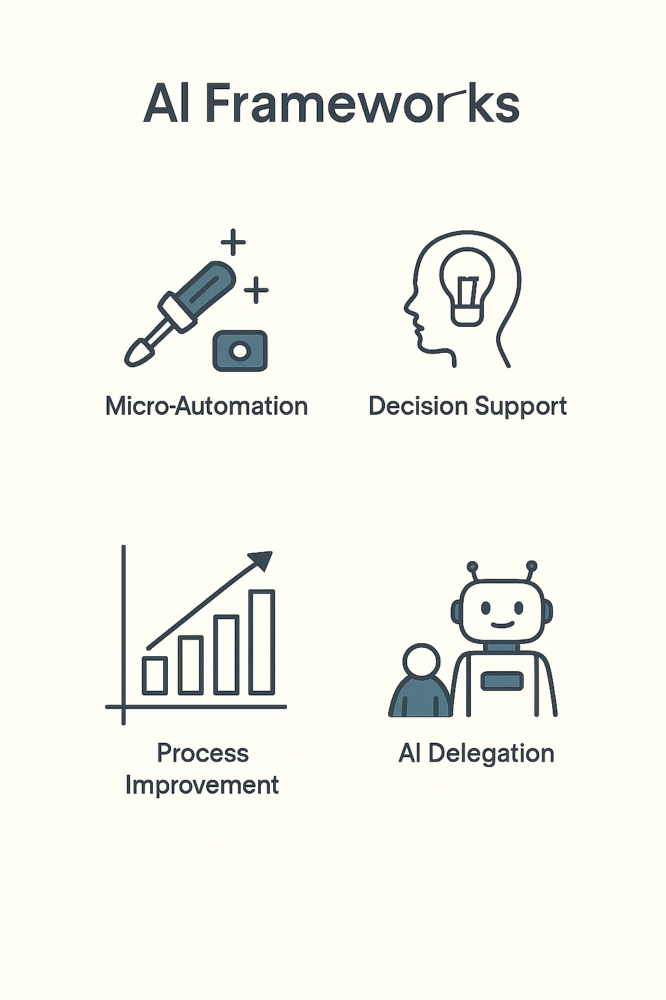
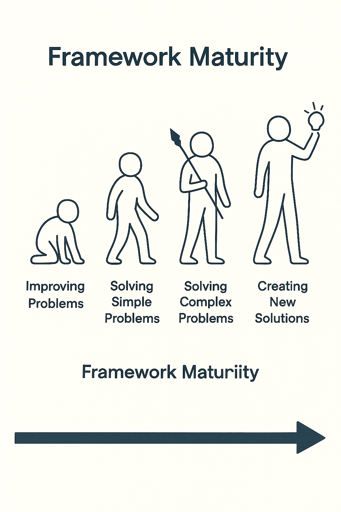

# AI Frameworks for Organizational Maturity
# Measuring and Advancing AI Readiness

> AI maturity frameworks help organizations assess their current capabilities and plan progression from ad-hoc experiments to systematic deployment. Different organizations will be at different stages, and that's perfectly fine.
---

## How to measure, compare, and advance AI readiness

> This slide explores an important aspect of working with AI systems. Understanding this concept will help you make better decisions when evaluating and deploying AI in your work.
---

## Why Frameworks Matter

AI adoption is not random  
Organizations mature in patterns  
Frameworks describe those patterns — so leaders can assess progress and plan investment

> This slide explores an important aspect of working with AI systems. Understanding this concept will help you make better decisions when evaluating and deploying AI in your work.
---

## The Three Frameworks We'll Cover

MIT CISR AI Maturity Model — academic, strategic, culture-focused  
Gartner AI Maturity Model — management-oriented, process-driven  
AWS Generative AI Maturity Model — cloud-native, focused on GenAI adoption

> This slide explores an important aspect of working with AI systems. Understanding this concept will help you make better decisions when evaluating and deploying AI in your work.
---

## The Purpose of Frameworks

Frameworks do three things:  
Provide a shared language  
Set expectations for what "maturity" means  
Guide decisions about where to invest next

> This slide explores an important aspect of working with AI systems. Understanding this concept will help you make better decisions when evaluating and deploying AI in your work.
---

## Framework 1: MIT CISR

Developed by the MIT Center for Information Systems Research  
Focus: Enterprise transformation through AI

> This slide explores an important aspect of working with AI systems. Understanding this concept will help you make better decisions when evaluating and deploying AI in your work.
---

## MIT CISR: The Four Stages

| Stage | Description | Organizational Focus |  
|-------|-------------|---------------------|  
| 1. Experiment & Prepare | Explore AI, build awareness, create policy. | Learning and literacy. |  
| 2. Build Pilots & Capabilities | Run pilots, hire talent, collect data. | Early wins, proof of value. |  
| 3. Industrialize AI | Embed AI in business systems. | Process and scale. |  
| 4. Future-Ready | AI aligns with strategy, drives new models. | Continuous innovation. |

> This slide explores an important aspect of working with AI systems. Understanding this concept will help you make better decisions when evaluating and deploying AI in your work.
---

## MIT CISR Key Insight

AI maturity is not about technology first — it's about organizational learning  
The more people who understand AI's purpose and limits, the faster the company evolves

> This slide explores an important aspect of working with AI systems. Understanding this concept will help you make better decisions when evaluating and deploying AI in your work.
---

## Framework 2: Gartner AI Maturity Model

Used widely by executives and consultants  
Focus: Operational adoption and measurable value

> AI maturity roadmaps provide step-by-step progression from initial experiments to systematic deployment. Understanding your current stage helps prioritize the right next steps.
---

## Gartner: The Five Levels

| Level | Description | Example Outcome |  
|-------|-------------|-----------------|  
| 1. Awareness | AI known, but little action. | Talks and articles. |  
| 2. Active | Pilots and small investments. | Test projects. |  
| 3. Operational | AI in production. | Measurable ROI. |  
| 4. Systemic | AI across departments. | Shared platforms. |  
| 5. Transformational | AI reshapes business model. | New products, markets. |

> This slide explores an important aspect of working with AI systems. Understanding this concept will help you make better decisions when evaluating and deploying AI in your work.
---

## Gartner Key Insight

Each level multiplies both technical capability and organizational trust  
AI maturity means scaling trust as much as tools

> This slide explores an important aspect of working with AI systems. Understanding this concept will help you make better decisions when evaluating and deploying AI in your work.
---

## Framework 3: AWS Generative AI Maturity

Created for cloud-based generative AI projects  
Focus: Adopting, governing, and scaling GenAI systems

> AI maturity roadmaps provide step-by-step progression from initial experiments to systematic deployment. Understanding your current stage helps prioritize the right next steps.
---

## AWS: The Four Levels

| Level | Description | Focus |  
|-------|-------------|-------|  
| 1. Envision | Identify GenAI opportunities. | Strategy and ideation. |  
| 2. Experiment | Run proofs of concept. | Learning through prototypes. |  
| 3. Launch | Move to production with guardrails. | Governance and delivery. |  
| 4. Scale | Expand across enterprise. | Reusability and trust. |

> This slide explores an important aspect of working with AI systems. Understanding this concept will help you make better decisions when evaluating and deploying AI in your work.
---

## AWS Key Insight

Generative AI maturity depends on data governance and responsible deployment more than model choice

> This slide explores an important aspect of working with AI systems. Understanding this concept will help you make better decisions when evaluating and deploying AI in your work.
---

## Comparing Frameworks

| Dimension | MIT CISR | Gartner | AWS |  
|-----------|----------|---------|-----|  
| Orientation | Strategic / Cultural | Operational / Business | Technical / Cloud |  
| Levels | 4 | 5 | 4 |  
| Endpoint | Future-ready enterprise | Transformational AI | Scaled, governed GenAI |  
| Primary Users | Executives, academics | Managers, consultants | IT leaders, builders |

> This slide explores an important aspect of working with AI systems. Understanding this concept will help you make better decisions when evaluating and deploying AI in your work.
---

## Common Structure

All frameworks share a rhythm:  
Experiment — try and learn  
Operationalize — prove and scale  
Transform — align and innovate  
Different names, same journey

> This slide explores an important aspect of working with AI systems. Understanding this concept will help you make better decisions when evaluating and deploying AI in your work.
---

## How to Use These at Work

Pick the framework that matches your company's focus  
Identify your current level honestly  
Define milestones for the next level  
Align AI projects with business value, not hype

> This slide explores an important aspect of working with AI systems. Understanding this concept will help you make better decisions when evaluating and deploying AI in your work.
---

## Example: A Regional Bank

Now: Level 2 (Active). Running pilot chatbots  
Goal: Level 3 (Operational). Integrate AI into customer service workflow  
Next Step: Train staff, set metrics, improve data quality

> Concrete examples illustrate abstract concepts and show how ideas apply in practice. Pay attention to what made these particular cases succeed or fail.
---

## Example: A Manufacturing Firm

Now: Level 3 (Operational). Predictive maintenance in place  
Goal: Level 4 (Systemic). Expand AI to quality control and logistics  
Next Step: Build shared data lake, unify analytics teams

> Concrete examples illustrate abstract concepts and show how ideas apply in practice. Pay attention to what made these particular cases succeed or fail.
---

## Discussion Prompt

Which framework fits your industry best — MIT, Gartner, or AWS?  
Which level do you think your organization is at right now?  
What would it take to move up one level?

> This slide explores an important aspect of working with AI systems. Understanding this concept will help you make better decisions when evaluating and deploying AI in your work.
---

## Summary

Frameworks turn buzzwords into structure  
They help you measure progress, set realistic goals, and design transformation deliberately

> This slide explores an important aspect of working with AI systems. Understanding this concept will help you make better decisions when evaluating and deploying AI in your work.
---

## Key Takeaway

AI maturity isn't about having the newest tool  
It's about knowing where you are, where you're going, and what to do next

> This slide explores an important aspect of working with AI systems. Understanding this concept will help you make better decisions when evaluating and deploying AI in your work.