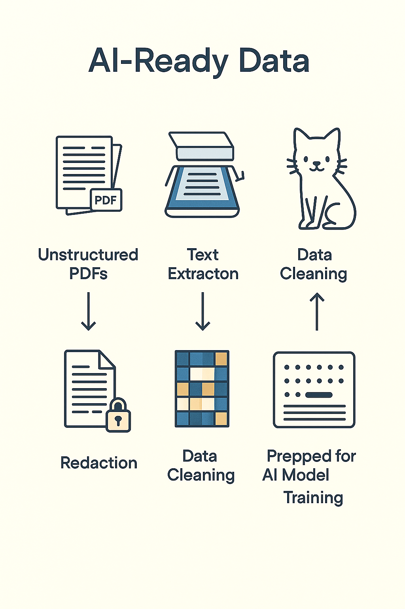
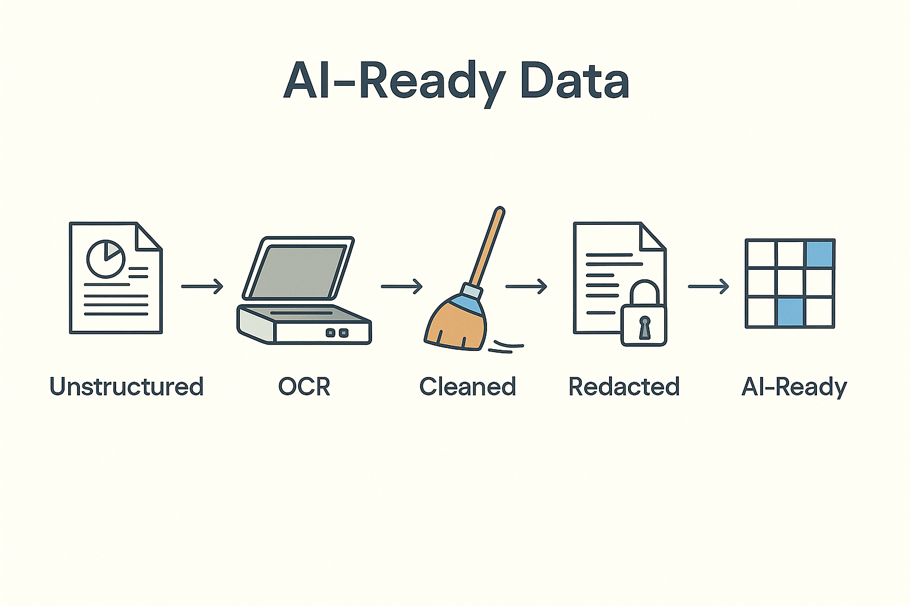

# AI-Ready Data
# Preparing Information for Machine Learning

> AI-ready data means data that's accessible, clean, well-documented, and properly labeled. More AI projects fail from data problems than algorithm problems, making data preparation crucial.
---

## How to prepare information for analysis, automation, and machine learning

> This slide explores an important aspect of working with AI systems. Understanding this concept will help you make better decisions when evaluating and deploying AI in your work.
---

## Why This Matters

AI is only as smart as the data it learns from.  
Most projects fail because the data isn't usable — not because the model is wrong.  
Good data makes AI possible.  
Bad data makes AI dangerous

> This slide explores an important aspect of working with AI systems. Understanding this concept will help you make better decisions when evaluating and deploying AI in your work.
---

## What "AI-Ready" Means

AI-ready data is:  
Accessible — stored in a usable format.  
Structured — organized with clear meaning.  
Clean — free of errors and duplicates.  
Ethical — compliant with privacy and security rules.  
Labeled or searchable — so models can learn from it

> This slide explores an important aspect of working with AI systems. Understanding this concept will help you make better decisions when evaluating and deploying AI in your work.
---

## The Reality Today

Most enterprise data lives in PDFs, emails, spreadsheets, and images.  
AI models can't understand those directly.  
They must be processed, extracted, and standardized first

> This slide explores an important aspect of working with AI systems. Understanding this concept will help you make better decisions when evaluating and deploying AI in your work.
---

## Example: PDF Documents

PDFs contain text, tables, and images locked in page layout.  
AI needs the text extracted, tables parsed, and metadata captured.  
Tools like OCR (Optical Character Recognition) or PDF-to-text pipelines convert them into machine-readable form

> Concrete examples illustrate abstract concepts and show how ideas apply in practice. Pay attention to what made these particular cases succeed or fail.
---

## Example: Images and Scanned Files

AI can't read pixels as words.  
You must:  
Use OCR to detect text.  
Clean noise or skewed scans.  
Tag images with context (date, document type, author).  
Only then can you build retrieval or classification systems

> Concrete examples illustrate abstract concepts and show how ideas apply in practice. Pay attention to what made these particular cases succeed or fail.
---

## Example: Redacting PII

Personal data such as names, phone numbers, and Social Security numbers must be removed before training.  
Redaction protects privacy and reduces legal risk.  
AI systems trained on raw sensitive data can create compliance violations

> Concrete examples illustrate abstract concepts and show how ideas apply in practice. Pay attention to what made these particular cases succeed or fail.
---

## Example: Audio and Video

Before models can analyze speech, you need:  
Transcription into text.  
Speaker identification.  
Time-stamped segments.  
That transforms unstructured content into searchable data

> Concrete examples illustrate abstract concepts and show how ideas apply in practice. Pay attention to what made these particular cases succeed or fail.
---

## Why Structure Matters

AI models need consistent input.  
For example:  
"John Doe – Customer ID 5421" must appear the same way every time.  
If one record says "Doe, John" and another "J. Doe," the model sees them as different people

> This slide explores an important aspect of working with AI systems. Understanding this concept will help you make better decisions when evaluating and deploying AI in your work.
---

## The Pipeline Mindset

Think of data preparation as a production line:  
Ingest — collect raw data.  
Extract — pull text or numbers.  
Clean — fix errors, remove noise.  
Transform — standardize format.  
Secure — redact or encrypt sensitive parts.  
Store — save in a governed catalog

> This slide explores an important aspect of working with AI systems. Understanding this concept will help you make better decisions when evaluating and deploying AI in your work.
---

## Metadata and Context

Metadata tells AI what data means.  
Without it, the model sees random words.  
Example: tagging a file as contract – renewal – 2023 helps retrieval and classification

> This slide explores an important aspect of working with AI systems. Understanding this concept will help you make better decisions when evaluating and deploying AI in your work.
---

## Common Problems

Multiple file formats.  
Inconsistent labels.  
Missing timestamps.  
Duplicate records.  
Sensitive fields mixed with non-sensitive data.  
Each problem reduces model accuracy and increases risk

> Understanding challenges and limitations is as important as knowing capabilities. Realistic assessment of obstacles helps you plan appropriately and avoid nasty surprises.
---

## Example: Customer Support Emails

Raw inbox = messy.  
AI-ready version = text cleaned, metadata added (date, topic, sentiment), PII redacted.  
That structured dataset supports chatbots, analytics, and trend detection

> Concrete examples illustrate abstract concepts and show how ideas apply in practice. Pay attention to what made these particular cases succeed or fail.
---

## Data Readiness Levels

| Level | Description | Example |  
|-------|-------------|---------|  
| 0 — Raw | Files scattered, unstructured | PDFs in shared folders |  
| 1 — Processed | Basic extraction, partial labels | CSVs from OCR |  
| 2 — Curated | Clean, governed, annotated | Dataset with metadata and privacy review |  
| 3 — Operational | Used safely in production | Cataloged and linked to AI workflows |

> AI-ready data means data that's accessible, clean, well-documented, and properly labeled. More AI projects fail from data problems than algorithm problems, making data preparation crucial.
---

## Governance and Compliance

AI-ready also means ethically ready.  
Data must respect:  
Privacy laws (GDPR, HIPAA, FERPA).  
Internal retention policies.  
Consent for secondary use.  
Governance isn't bureaucracy — it's trust

> AI governance establishes policies, processes, and oversight for responsible AI deployment. This includes defining acceptable use, review procedures, and accountability mechanisms.
---

## Example from Healthcare

Medical records contain sensitive notes and images.  
Before AI can use them:  
Text is anonymized.  
Scans are labeled by modality.  
Diagnoses are coded.  
This makes clinical AI both accurate and compliant

> Concrete examples illustrate abstract concepts and show how ideas apply in practice. Pay attention to what made these particular cases succeed or fail.
---

## Example from Energy Sector

Sensor data from pipelines includes outliers and noise.  
Before modeling:  
Remove faulty readings.  
Align timestamps.  
Standardize units.  
That turns raw telemetry into reliable input for prediction

> Concrete examples illustrate abstract concepts and show how ideas apply in practice. Pay attention to what made these particular cases succeed or fail.
---

## Why Redaction and Extraction Matter

An unredacted document can leak identity.  
An unextracted document is invisible to the model.  
Both break trust and accuracy

> This slide explores an important aspect of working with AI systems. Understanding this concept will help you make better decisions when evaluating and deploying AI in your work.
---

## The Cost of Unready Data

Gartner estimates 80% of AI project time goes to data preparation.  
Skipping it leads to inaccurate models, compliance risk, and reputational harm.  
Readiness pays off in reliability and reusability

> This slide explores an important aspect of working with AI systems. Understanding this concept will help you make better decisions when evaluating and deploying AI in your work.
---

## Discussion Prompt

Think about your organization.  
Where does most data live — PDFs, images, spreadsheets, databases?  
What would need to change to make it AI-ready?

> This slide explores an important aspect of working with AI systems. Understanding this concept will help you make better decisions when evaluating and deploying AI in your work.
---

## Summary

AI-ready data is structured, clean, secure, and documented.  
Preparation is the invisible work that makes AI succeed.  
Models are flashy. Data makes them useful

> This slide explores an important aspect of working with AI systems. Understanding this concept will help you make better decisions when evaluating and deploying AI in your work.
---

## Key Takeaway

You don't start with models.  
You start with data.  
If your data isn't ready, your AI isn't either

> This slide explores an important aspect of working with AI systems. Understanding this concept will help you make better decisions when evaluating and deploying AI in your work.