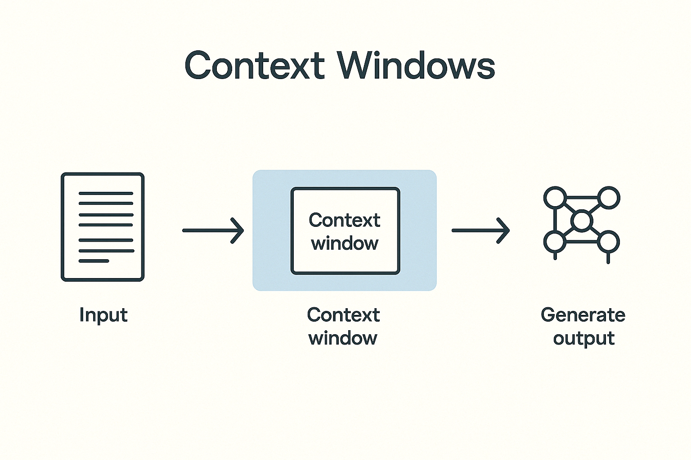
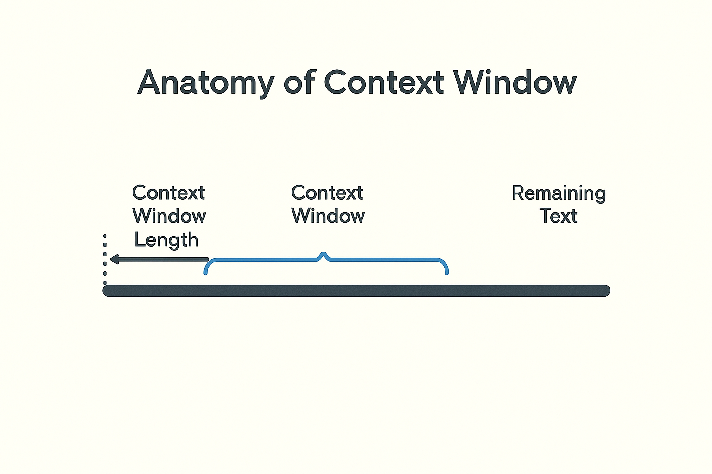
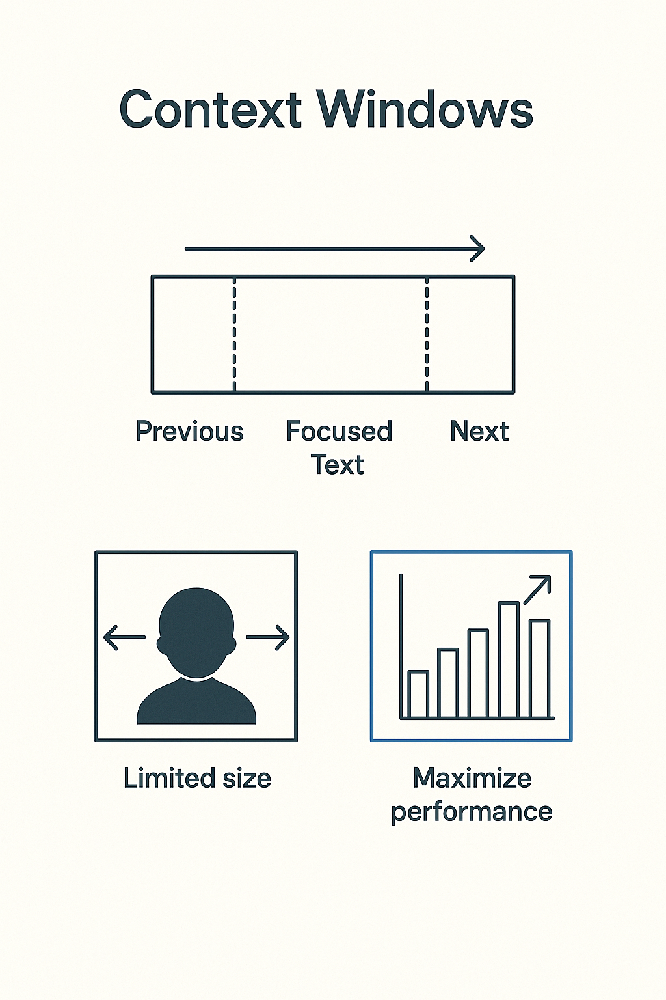

# Context Windows
# How AI Models Manage Memory

> Context windows define how much text a language model can consider at once. This fundamental limitation shapes architecture decisions around document processing, conversation management, and retrieval systems.
---

## How models remember — and forget — information during a conversation

> This slide explores an important aspect of working with AI systems. Understanding this concept will help you make better decisions when evaluating and deploying AI in your work.
---

## Why This Matters

Every model has limits on what it can read at once.  
Those limits affect quality, speed, and cost.  
Knowing how context windows work helps you design better prompts and systems

> This slide explores an important aspect of working with AI systems. Understanding this concept will help you make better decisions when evaluating and deploying AI in your work.
---

## The Core Idea

A context window is the amount of text a model can "see" in one interaction.  
Models don't have memory.  
They only see what fits inside their context window — a sliding space of tokens.  
When it fills up, the oldest text drops out

> This slide explores an important aspect of working with AI systems. Understanding this concept will help you make better decisions when evaluating and deploying AI in your work.
---

## The Sliding Window Metaphor

Think of a model as reading through a moving window over text.  
It processes only the visible section.  
New text enters  
Old text leaves
No history beyond what's inside the frame

> This slide explores an important aspect of working with AI systems. Understanding this concept will help you make better decisions when evaluating and deploying AI in your work.
---

## Example: Window Size

If a model has a 128k context window, it can handle about 128,000 tokens — roughly 90,000 words.  
That's a short book, not a library.  
Everything beyond that is invisible to the model

> Concrete examples illustrate abstract concepts and show how ideas apply in practice. Pay attention to what made these particular cases succeed or fail.
---

## Tokens, Not Words

Models process tokens, not words.  
Tokens are chunks of text, sometimes whole words, sometimes fragments.  
"Understanding" = converting tokens into embeddings, reasoning over them, and predicting the next token

> This slide explores an important aspect of working with AI systems. Understanding this concept will help you make better decisions when evaluating and deploying AI in your work.
---

## What Happens Inside

The model encodes all input tokens into vectors.  
It compares patterns and relationships between them.  
Attention layers compute which tokens matter most.  
That is why the window size matters: more tokens mean more comparisons

> This slide explores an important aspect of working with AI systems. Understanding this concept will help you make better decisions when evaluating and deploying AI in your work.
---

## Why Context Windows Exist

Each extra token adds cost and compute time.  
Larger windows slow response and increase price.  
Models trade off size, speed, and accuracy

> Context windows define how much text a language model can consider at once. This fundamental limitation shapes architecture decisions around document processing, conversation management, and retrieval systems.
---

## Short vs Long Windows

| Window Size | Typical Use | Trade-offs |  
|-------------|-------------|------------|  
| 8k–16k | Chat, coding help | Fast, cheap, less memory |  
| 32k–128k | Research, analysis | Slower, better recall |  
| 1M+ | Enterprise or specialized models | Expensive, needs optimization |

> Comparing different approaches reveals their relative strengths and tradeoffs. The best choice depends on your specific context, constraints, and objectives.
---

## Real Model Examples

Each model has a fixed token limit:  
GPT-4 Turbo: ~128k tokens  
Gemini 1.5 Pro: ~1M tokens  
More tokens = more memory but higher cost

> Concrete examples illustrate abstract concepts and show how ideas apply in practice. Pay attention to what made these particular cases succeed or fail.
---

## The "Forgetfulness" Problem

When a model runs out of window space, older text is dropped or truncated.  
You think it remembers, but it doesn't.  
Context loss creates inconsistency or hallucination

> Understanding challenges and limitations is as important as knowing capabilities. Realistic assessment of obstacles helps you plan appropriately and avoid nasty surprises.
---

## Example: Conversation Memory

Prompt: "The meeting is at 3 PM in Dallas."  
Later message: "What time is the meeting?"  
If "Dallas" and "3 PM" are still inside the context window, it answers correctly.  
If not, it guesses

> Concrete examples illustrate abstract concepts and show how ideas apply in practice. Pay attention to what made these particular cases succeed or fail.
---

## The Performance Sweet Spot

Performance declines when:  
Prompts exceed optimal window size.  
Context contains irrelevant text.  
Redundant information floods attention layers.  
Shorter, focused context improves coherence and reduces latency

> This slide explores an important aspect of working with AI systems. Understanding this concept will help you make better decisions when evaluating and deploying AI in your work.
---

## How to Think About It

Treat context as working memory, not long-term memory.  
Feed only what the model needs right now.  
Use retrieval systems to fetch relevant context when required

> This slide explores an important aspect of working with AI systems. Understanding this concept will help you make better decisions when evaluating and deploying AI in your work.
---

## Example: Chat Session

If you paste ten pages of notes, the model spends energy reading everything.  
If you provide a short summary or relevant excerpt, it performs better and costs less

> Concrete examples illustrate abstract concepts and show how ideas apply in practice. Pay attention to what made these particular cases succeed or fail.
---

## How to Maximize Performance

Summarize past messages.  
Chunk documents into smaller segments.  
Retrieve only relevant sections per query.  
Refresh context instead of growing it endlessly

> This slide explores an important aspect of working with AI systems. Understanding this concept will help you make better decisions when evaluating and deploying AI in your work.
---

## Context Management Strategies

**Summarization:** Systems summarize earlier content.  
Summaries replace full text, preserving meaning but saving space

**Chunking:** Long documents are split into chunks that fit into context windows.  
Each chunk is separately processed and reassembled during retrieval

> This slide explores an important aspect of working with AI systems. Understanding this concept will help you make better decisions when evaluating and deploying AI in your work.
---

## Context Management in Practice

Old approach: dump everything into the prompt.  
Modern approach: retrieve only what matters using search, indexing, or protocols like MCP

> This slide explores an important aspect of working with AI systems. Understanding this concept will help you make better decisions when evaluating and deploying AI in your work.
---

## Vector Recall and RAG

When older context scrolls out, embeddings help recall similar information.  
That's how retrieval-augmented generation (RAG) restores memory

> Retrieval-Augmented Generation grounds language models in real documents by retrieving relevant information before generating responses. This architecture has become standard for building reliable knowledge systems.
---

## Relation to MCP

MCP helps models fetch context dynamically.  
Instead of giving the model all your data, it requests only the parts needed for each task.  
This keeps the active window small and efficient

> The Model Context Protocol standardizes how AI applications access external data and tools. This abstraction layer enables building AI systems that can work with multiple different data sources and capabilities.
---

## Analogy: The Desk

The context window is like the desk in front of you.  
You can only spread out a few papers at a time.  
The rest stays in the filing cabinet until needed

> This slide explores an important aspect of working with AI systems. Understanding this concept will help you make better decisions when evaluating and deploying AI in your work.
---

## Evaluating a Model's Window

When choosing a model, ask:  
What is its max context window?  
What are the cost implications?  
How does quality change near the limit?  
Those answers determine which model fits your workload

> This slide explores an important aspect of working with AI systems. Understanding this concept will help you make better decisions when evaluating and deploying AI in your work.
---

## What Happens When You Exceed It

Extra tokens are ignored or truncated.  
Sometimes the model fails silently.  
You lose precision, and cost still increases.  
Always know your ceiling

> This slide explores an important aspect of working with AI systems. Understanding this concept will help you make better decisions when evaluating and deploying AI in your work.
---

## Example of Efficiency

Two identical questions:  
One with a focused prompt, one with a full transcript.  
The focused prompt runs faster, costs less, and answers more accurately

> Concrete examples illustrate abstract concepts and show how ideas apply in practice. Pay attention to what made these particular cases succeed or fail.
---

## The Tradeoff

Bigger context improves reasoning but increases latency, cost, and error risk.  
Smarter context management beats brute force expansion

> This slide explores an important aspect of working with AI systems. Understanding this concept will help you make better decisions when evaluating and deploying AI in your work.
---

## Discussion Prompt

Think about your own work.  
Where do you overload context — too much background, too many documents, too long a thread?  
How could you narrow it?

> This slide explores an important aspect of working with AI systems. Understanding this concept will help you make better decisions when evaluating and deploying AI in your work.
---

## Summary

Context defines what a model "knows" at any moment.  
The context window is the model's attention span.  
Tokens in → understanding out.  
Memory beyond that must be engineered

> This slide explores an important aspect of working with AI systems. Understanding this concept will help you make better decisions when evaluating and deploying AI in your work.
---

## Key Takeaway

You don't need to make the window bigger.  
You need to use it better.  
Good prompt design and smart retrieval always outperform brute force

> This slide explores an important aspect of working with AI systems. Understanding this concept will help you make better decisions when evaluating and deploying AI in your work.