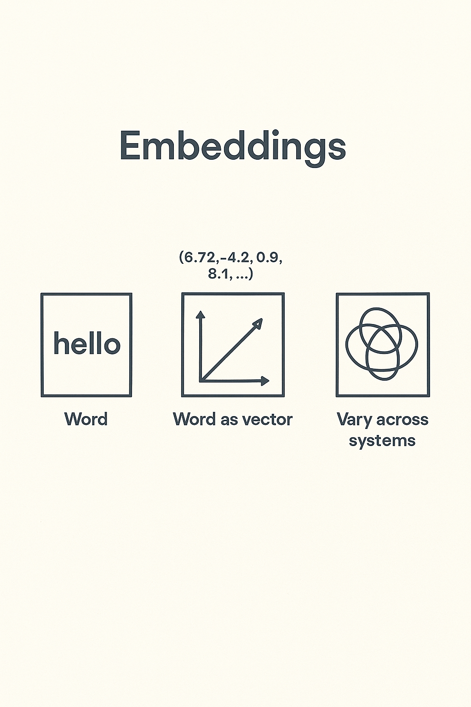
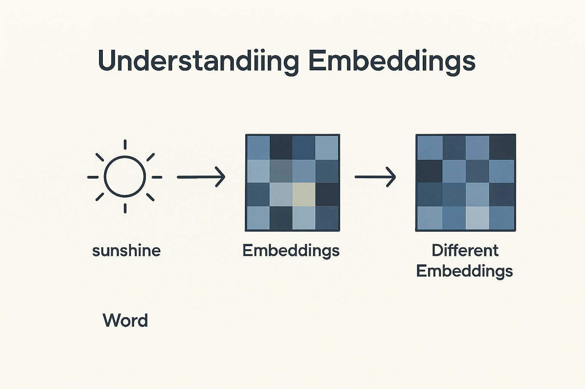

# Embeddings
# How Words Become Vectors

> Embeddings are mathematical representations of meaning that enable semantic search and similarity comparison. They've become foundational to modern AI systems, powering everything from search to recommendations.
---

## Turning language into math

> This slide explores an important aspect of working with AI systems. Understanding this concept will help you make better decisions when evaluating and deploying AI in your work.
---

## The Idea

Machines cannot read words  
They understand numbers  
Embeddings map words into numbers that preserve meaning

> This slide explores an important aspect of working with AI systems. Understanding this concept will help you make better decisions when evaluating and deploying AI in your work.
---

## From Words to Numbers

Each word becomes a vector  
A vector is a list of numbers that describe relationships  
Distance in that space reflects meaning

> This slide explores an important aspect of working with AI systems. Understanding this concept will help you make better decisions when evaluating and deploying AI in your work.
---

## From Tokens to Meaning

Tokenization turns text into IDs  
Embeddings turn those IDs into coordinates in space  
Each point represents meaning  
Words close together mean similar things

> This slide explores an important aspect of working with AI systems. Understanding this concept will help you make better decisions when evaluating and deploying AI in your work.
---

## A Simple Example

"King" → [0.27, 0.81, 0.43, …]  
"Queen" → [0.25, 0.79, 0.47, …]  
Subtract and add vectors:  
King – Man + Woman ≈ Queen  
Meaning is geometric

> Concrete examples illustrate abstract concepts and show how ideas apply in practice. Pay attention to what made these particular cases succeed or fail.
---

## Example: Word Meaning Clusters

"king," "queen," "man," "woman."  
Their embeddings cluster by gender and royalty  
The distance between them carries semantic relationships

> Concrete examples illustrate abstract concepts and show how ideas apply in practice. Pay attention to what made these particular cases succeed or fail.
---

## Visualizing Embedding Space

Imagine a 3D map  
Each word is a dot  
Distance = difference in meaning  
Nearby dots = similar context  
Opposite sides = different topics

> Embeddings are mathematical representations of meaning that enable semantic search and similarity comparison. They've become foundational to modern AI systems, powering everything from search to recommendations.
---

## Why Embeddings Matter

They allow models to measure similarity  
They power search, clustering, summarization, and generation  
They turn text into data we can compute on

> Embeddings are mathematical representations of meaning that enable semantic search and similarity comparison. They've become foundational to modern AI systems, powering everything from search to recommendations.
---

## The First Generation: Word2Vec

Word2Vec learned by prediction  
Skip-gram: predict neighbors from a target word  
CBOW: predict target from neighbors  
Vectors reflect co-occurrence statistics

> This slide explores an important aspect of working with AI systems. Understanding this concept will help you make better decisions when evaluating and deploying AI in your work.
---

## GloVe

GloVe used global counts, not local prediction  
It built a matrix of word co-occurrences and factored it  
It produced stable vectors that captured analogy and frequency

> This slide explores an important aspect of working with AI systems. Understanding this concept will help you make better decisions when evaluating and deploying AI in your work.
---

## Context Independence Problem

Both Word2Vec and GloVe gave one vector per word  
"Bank" meant the same in "river bank" and "credit bank."  
Context was lost

> Understanding challenges and limitations is as important as knowing capabilities. Realistic assessment of obstacles helps you plan appropriately and avoid nasty surprises.
---

## The New Generation: Contextual Embeddings

Transformers changed this  
Models like BERT create different vectors for the same word in different contexts  
Meaning now depends on the sentence

> Embeddings are mathematical representations of meaning that enable semantic search and similarity comparison. They've become foundational to modern AI systems, powering everything from search to recommendations.
---

## Example: Context Shift

Sentence A: "He sat by the bank of the river."  
Sentence B: "She works at the bank downtown."  
Old models: same vector  
BERT: two distinct vectors

> Concrete examples illustrate abstract concepts and show how ideas apply in practice. Pay attention to what made these particular cases succeed or fail.
---

## Why Context Matters

The same word changes position with different meaning  
"Bank" (money) vs. "Bank" (river)  
The model understands context by comparing surrounding embeddings

> This slide explores an important aspect of working with AI systems. Understanding this concept will help you make better decisions when evaluating and deploying AI in your work.
---

## Sentence and Document Embeddings

We can extend embeddings beyond words  
Sentences are averaged from their word vectors  
Paragraphs and documents become larger embeddings  
This supports search, clustering, and retrieval

> Embeddings are mathematical representations of meaning that enable semantic search and similarity comparison. They've become foundational to modern AI systems, powering everything from search to recommendations.
---

## OpenAI and Modern Embeddings

OpenAI models like text-embedding-3-large produce 3000+ dimension vectors  
Trained on massive corpora across domains  
They capture abstract relationships far beyond words

> Embeddings are mathematical representations of meaning that enable semantic search and similarity comparison. They've become foundational to modern AI systems, powering everything from search to recommendations.
---

## Dimensionality and Variation

Each system uses different dimensions and training data  
Word2Vec: ~300  
BERT base: 768  
OpenAI: >3000  
Higher dimensions capture nuance but increase compute cost

> This slide explores an important aspect of working with AI systems. Understanding this concept will help you make better decisions when evaluating and deploying AI in your work.
---

## Comparing Systems

| System | Context | Dimensionality | Training Method | Example Use |  
|--------|---------|----------------|-----------------|-------------|  
| Word2Vec | None | ~300 | Predict next word | Analogy |  
| GloVe | None | ~300 | Co-occurrence matrix | Semantic grouping |  
| BERT | Yes | 768 | Transformer encoder | Contextual understanding |  
| OpenAI | Yes | 1536–3072 | Foundation model | Retrieval and reasoning |

> This slide explores an important aspect of working with AI systems. Understanding this concept will help you make better decisions when evaluating and deploying AI in your work.
---

## Visualization Techniques

Use PCA or t-SNE to reduce vectors to 2D  
Words with similar meaning cluster together  
Plot reveals language structure

> This slide explores an important aspect of working with AI systems. Understanding this concept will help you make better decisions when evaluating and deploying AI in your work.
---

## Embeddings in Action

Embed a query and compare to embedded documents  
Use cosine similarity to find the closest meaning  
This is how semantic search works

> Embeddings are mathematical representations of meaning that enable semantic search and similarity comparison. They've become foundational to modern AI systems, powering everything from search to recommendations.
---

## Practical Applications

**Search engines:** "doctor salary" finds "physician income."  
**Chatbots:** retrieve matching knowledge chunks
**Recommendation systems:** suggest similar items

> This slide explores an important aspect of working with AI systems. Understanding this concept will help you make better decisions when evaluating and deploying AI in your work.
---

## Retrieval and RAG

When you ask a question, your prompt is embedded  
The system searches a vector database for nearby matches  
That's retrieval-augmented generation (RAG)

> Retrieval-Augmented Generation grounds language models in real documents by retrieving relevant information before generating responses. This architecture has become standard for building reliable knowledge systems.
---

## Embeddings vs. Keywords

Keyword search looks for exact words  
Embedding search looks for meaning  
That's why "AI regulation" also finds "machine learning law."

> Embeddings are mathematical representations of meaning that enable semantic search and similarity comparison. They've become foundational to modern AI systems, powering everything from search to recommendations.
---

## Why Embeddings Differ

Each model learns from different text  
Legal text shapes vectors differently than social media  
Culture and time shift meaning  
Embeddings evolve as language evolves

> Embeddings are mathematical representations of meaning that enable semantic search and similarity comparison. They've become foundational to modern AI systems, powering everything from search to recommendations.
---

## Beyond Text

Embeddings now cover images, audio, and code  
A picture can embed into the same vector space as a caption  
Multimodal embeddings unify all data types

> This slide explores an important aspect of working with AI systems. Understanding this concept will help you make better decisions when evaluating and deploying AI in your work.
---

## The New Role for Analysts

We no longer code meaning manually  
We extract it from embeddings  
Our skill is in interpretation, filtering, and grounding

> This slide explores an important aspect of working with AI systems. Understanding this concept will help you make better decisions when evaluating and deploying AI in your work.
---

## Summary

Embeddings turn language into geometry  
They let models understand relationships and recall relevant context  
Meaning lives in distance

> This slide explores an important aspect of working with AI systems. Understanding this concept will help you make better decisions when evaluating and deploying AI in your work.
---

## Closing

Embeddings are the language of AI  
They make meaning measurable  
The future depends on how we use and interpret them

> This slide explores an important aspect of working with AI systems. Understanding this concept will help you make better decisions when evaluating and deploying AI in your work.