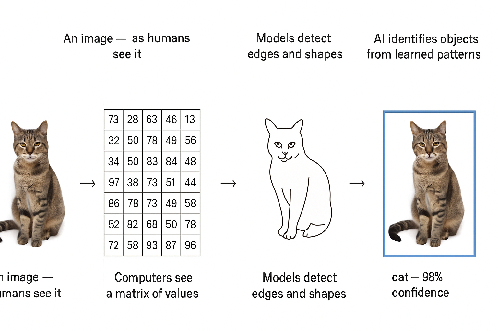
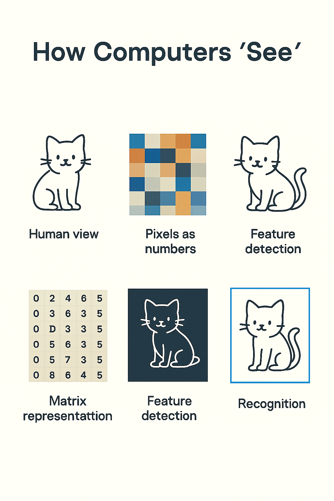

# How Computers See
# From Pixels to Perception

> Computer vision systems process images through hierarchical feature detection, starting from edges and textures and building up to complex patterns. Understanding this hierarchy helps explain both capabilities and limitations.
---

## From pixels to perception

> This slide explores an important aspect of working with AI systems. Understanding this concept will help you make better decisions when evaluating and deploying AI in your work.
---

## Why This Matters

AI doesn't see pictures the way people do  
It converts images into numbers  
Understanding that translation explains how computer vision works — and where it can fail

> This slide explores an important aspect of working with AI systems. Understanding this concept will help you make better decisions when evaluating and deploying AI in your work.
---

## The Core Idea

A computer "sees" by representing every image as a matrix of numbers  
Each pixel becomes a value describing color and brightness  
That matrix is the input to a vision model

> This slide explores an important aspect of working with AI systems. Understanding this concept will help you make better decisions when evaluating and deploying AI in your work.
---

## Example: A Simple Image

Imagine a 3×3 black-and-white image  
Each pixel can be 0 (black) or 1 (white)  
The computer sees:  
`[[0, 0, 1], [0, 1, 1], [1, 1, 0]]`  
That's how every picture begins — as numbers in a grid

> Concrete examples illustrate abstract concepts and show how ideas apply in practice. Pay attention to what made these particular cases succeed or fail.
---

## Color Images

Color images use three matrices, one for each channel:  
Red  
Green  
Blue  
Each channel has values from 0 to 255  
Together they describe every pixel's color

> This slide explores an important aspect of working with AI systems. Understanding this concept will help you make better decisions when evaluating and deploying AI in your work.
---

## From Numbers to Meaning

The computer doesn't "see a cat."  
It detects patterns in the numbers — edges, shapes, textures — and learns which patterns belong to cats  
Vision models transform pixel data into meaning through layers of pattern recognition

> This slide explores an important aspect of working with AI systems. Understanding this concept will help you make better decisions when evaluating and deploying AI in your work.
---

## How Models Learn Vision

Early layers find edges and lines  
Middle layers detect shapes and textures  
Later layers recognize objects or scenes  
Each layer processes the image matrix mathematically

> Models learn by adjusting internal parameters to minimize errors on training data. Understanding this learning process helps explain both capabilities and limitations like overfitting.
---

## Key Computer Vision Tasks

| Task | What It Does | Example |  
|------|--------------|---------|  
| Image Classification | Identify what's in a picture | "This is a dog." |  
| Object Detection | Find and label items | "Dog at (x, y). Ball at (x₂, y₂)." |  
| Object Tracking | Follow an object over time | Track cars across video frames. |  
| Segmentation | Outline each object's shape | Detect cracks on a pipeline. |

> Computer vision systems process images through hierarchical feature detection, starting from edges and textures and building up to complex patterns. Understanding this hierarchy helps explain both capabilities and limitations.
---

## Example: Image Classification

A camera captures an image of a bird  
The model compares pixel patterns to known examples  
Output: "sparrow – 97% confidence."  
That probability comes from how strongly the matrix matches learned features

> Concrete examples illustrate abstract concepts and show how ideas apply in practice. Pay attention to what made these particular cases succeed or fail.
---

## Example: Object Detection

A warehouse camera identifies boxes and forklifts  
The model draws bounding boxes around each  
Those coordinates come from scanning the image matrix region by region

> Concrete examples illustrate abstract concepts and show how ideas apply in practice. Pay attention to what made these particular cases succeed or fail.
---

## Example: Object Tracking

In traffic analytics, each car becomes an ID  
The system tracks the same object across frames  
It compares pixel patterns and motion vectors to follow direction and speed

> Concrete examples illustrate abstract concepts and show how ideas apply in practice. Pay attention to what made these particular cases succeed or fail.
---

## Example: Segmentation

In medical imaging, segmentation isolates a tumor from surrounding tissue  
Each pixel is labeled as "tumor" or "background."  
Doctors can measure size or growth precisely

> Concrete examples illustrate abstract concepts and show how ideas apply in practice. Pay attention to what made these particular cases succeed or fail.
---

## Vision Beyond Visible Light

Computers aren't limited to the human eye  
They "see" across many parts of the spectrum:  
Infrared detects heat  
Ultraviolet shows chemical traces  
LIDAR measures distance with laser pulses  
Different sensors create different matrices

> This slide explores an important aspect of working with AI systems. Understanding this concept will help you make better decisions when evaluating and deploying AI in your work.
---

## Example: Infrared Imaging

Used in search and rescue  
Heat signatures appear as color gradients  
A computer reads those gradients numerically to detect people in low light

> Concrete examples illustrate abstract concepts and show how ideas apply in practice. Pay attention to what made these particular cases succeed or fail.
---

## Example: LIDAR

LIDAR sends out laser pulses and measures reflection time  
Each point becomes (x, y, z)  
The result is a point cloud — a 3D matrix of distance values  
Self-driving cars use this to map surroundings in real time

> Concrete examples illustrate abstract concepts and show how ideas apply in practice. Pay attention to what made these particular cases succeed or fail.
---

## Example: Multispectral Cameras

Agricultural drones capture several wavelengths beyond visible light  
AI compares reflectance across bands to detect crop stress or water shortage

> Concrete examples illustrate abstract concepts and show how ideas apply in practice. Pay attention to what made these particular cases succeed or fail.
---

## Why This Matters for Business

Computer vision supports:  
Quality control in manufacturing  
Safety monitoring in oil and gas  
Medical diagnostics from imaging  
Logistics and asset tracking  
All begin with the same process: images → numbers → patterns → decisions

> This slide explores an important aspect of working with AI systems. Understanding this concept will help you make better decisions when evaluating and deploying AI in your work.
---

## The Challenge of Vision Data

Vision data is heavy and noisy  
Lighting, angle, and resolution change meaning  
AI must normalize and clean inputs before analysis  
Garbage pixels produce garbage predictions

> Understanding challenges and limitations is as important as knowing capabilities. Realistic assessment of obstacles helps you plan appropriately and avoid nasty surprises.
---

## The Human Role

Computers don't understand context or intent  
People define what matters, label data, and interpret results  
Vision AI amplifies human perception — it doesn't replace it

> This slide explores an important aspect of working with AI systems. Understanding this concept will help you make better decisions when evaluating and deploying AI in your work.
---

## Discussion Prompt

Where could "seeing like a computer" help your work?  
What kinds of images or sensors exist in your field — cameras, drones, scanners, satellites?  
How might converting that visual data into numbers unlock new insight?

> This slide explores an important aspect of working with AI systems. Understanding this concept will help you make better decisions when evaluating and deploying AI in your work.
---

## Summary

Computers see by turning light into data  
Each pixel becomes a number  
From those numbers, models detect patterns and meaning  
Vision is math made visible

> This slide explores an important aspect of working with AI systems. Understanding this concept will help you make better decisions when evaluating and deploying AI in your work.
---

## Key Takeaway

A camera captures color  
A model captures structure  
Together, they turn sight into knowledge

> This slide explores an important aspect of working with AI systems. Understanding this concept will help you make better decisions when evaluating and deploying AI in your work.