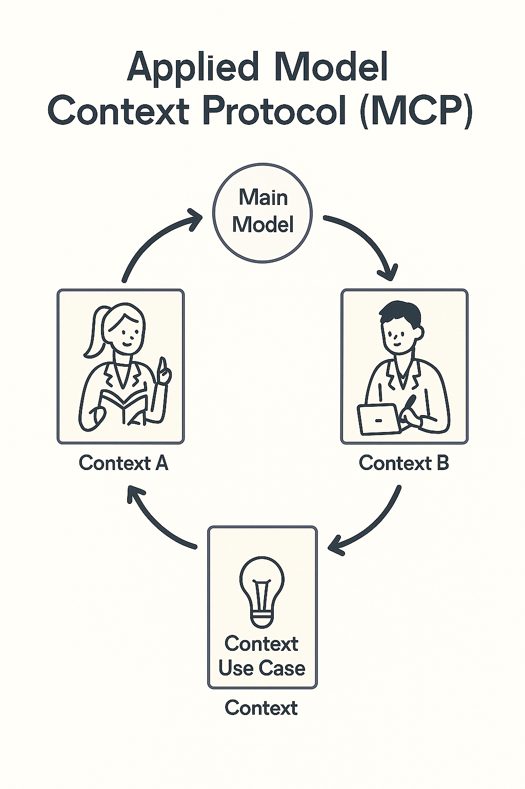

# Model Context Protocol (MCP)
# How AI Tools Share Context Safely

> The Model Context Protocol standardizes how AI applications access external data and tools. This abstraction layer enables building AI systems that can work with multiple different data sources and capabilities.
---

## How AI tools share context safely and intelligently

> This slide explores an important aspect of working with AI systems. Understanding this concept will help you make better decisions when evaluating and deploying AI in your work.
---

## Why It Matters

AI systems work best when they know your context.  
Today, each app or tool holds its own data.  
MCP lets them talk to each other securely and on your terms

> This slide explores an important aspect of working with AI systems. Understanding this concept will help you make better decisions when evaluating and deploying AI in your work.
---

## The Problem

You use many tools — documents, calendars, emails, databases.  
Each has data you might want an AI assistant to use.  
Without MCP, every tool must be integrated manually.  
That is slow, fragile, and unsafe

> Understanding challenges and limitations is as important as knowing capabilities. Realistic assessment of obstacles helps you plan appropriately and avoid nasty surprises.
---

## The Old Way

You copied and pasted between systems.  
Developers built APIs for each connection.  
Each integration had unique rules.  
Security and privacy were hard to manage

> This slide explores an important aspect of working with AI systems. Understanding this concept will help you make better decisions when evaluating and deploying AI in your work.
---

## What MCP Does

MCP is a standard that defines how AI tools exchange context.  
It tells a model what data it can access and how.  
It works through permissioned, auditable requests

> The Model Context Protocol standardizes how AI applications access external data and tools. This abstraction layer enables building AI systems that can work with multiple different data sources and capabilities.
---

## Key Idea

You keep control of your data.  
The AI gets temporary, limited context — not full access.  
That context may include text, documents, or structured data

> This slide explores an important aspect of working with AI systems. Understanding this concept will help you make better decisions when evaluating and deploying AI in your work.
---

## Everyday Analogy

Think of MCP like a translator at a meeting.  
Each person (tool) speaks a different language.  
The translator shares only what's relevant, no more

> This slide explores an important aspect of working with AI systems. Understanding this concept will help you make better decisions when evaluating and deploying AI in your work.
---

## Why Context Matters

Models without context guess.  
Models with context reason.  
Context tells the model what task, data, and constraints to apply

> This slide explores an important aspect of working with AI systems. Understanding this concept will help you make better decisions when evaluating and deploying AI in your work.
---

## What "Context" Means

Context can be:  
A document or dataset  
A company policy  
A user's past query or history  
The current project or workspace  
It defines what the model "knows" right now

> This slide explores an important aspect of working with AI systems. Understanding this concept will help you make better decisions when evaluating and deploying AI in your work.
---

## Example: Workplace Assistant

Without MCP: the AI knows nothing about your company's policies.  
With MCP: it retrieves the right documents when you ask, "Summarize our expense policy."  
No permanent data transfer occurs

> Concrete examples illustrate abstract concepts and show how ideas apply in practice. Pay attention to what made these particular cases succeed or fail.
---

## Example: Research Assistant

You ask, "Compare our last two reports."  
MCP allows the model to fetch those specific files, process them, and forget them afterward.  
No manual upload needed

> Concrete examples illustrate abstract concepts and show how ideas apply in practice. Pay attention to what made these particular cases succeed or fail.
---

## The Structure

MCP has three main roles:  
Client — the AI app or model.  
Server — the tool or data source.  
Protocol — the rules for how they talk.  
This standardizes context exchange

> This slide explores an important aspect of working with AI systems. Understanding this concept will help you make better decisions when evaluating and deploying AI in your work.
---

## What Makes MCP Different

No scraping.  
No permanent data sharing.  
You grant access for one action, not forever.  
You can audit and revoke anytime

> The Model Context Protocol standardizes how AI applications access external data and tools. This abstraction layer enables building AI systems that can work with multiple different data sources and capabilities.
---

## Why Businesses Care

MCP reduces risk and friction.  
It allows teams to use AI within compliance rules.  
It cuts cost and duplication.  
It simplifies how AI connects to enterprise systems

> This slide explores an important aspect of working with AI systems. Understanding this concept will help you make better decisions when evaluating and deploying AI in your work.
---

## Why Learners Should Care

As an AI user, you will soon work in MCP-aware tools.  
Understanding it means you know:  
How context improves AI quality  
What permissions you grant  
How to maintain control of your data

> This slide explores an important aspect of working with AI systems. Understanding this concept will help you make better decisions when evaluating and deploying AI in your work.
---

## Example Workflow

You open a workspace with your files.  
You ask the AI a question.  
MCP fetches context from approved sources.  
The AI processes and returns an answer.  
Access closes.  
Simple, safe, repeatable

> Concrete examples illustrate abstract concepts and show how ideas apply in practice. Pay attention to what made these particular cases succeed or fail.
---

## Human Analogy

Think of MCP as asking a librarian for a book rather than giving the library your house key.  
The model reads only what it needs, when it needs it

> This slide explores an important aspect of working with AI systems. Understanding this concept will help you make better decisions when evaluating and deploying AI in your work.
---

## Governance Benefits

Auditable logs of every request.  
Standard format for approvals.  
Clear boundaries between systems.  
Essential for regulated industries

> AI governance establishes policies, processes, and oversight for responsible AI deployment. This includes defining acceptable use, review procedures, and accountability mechanisms.
---

## The Bigger Picture

MCP is part of a shift in AI from "all-knowing models" to "bounded, permissioned models."  
It supports collaboration across tools without chaos

> This slide explores an important aspect of working with AI systems. Understanding this concept will help you make better decisions when evaluating and deploying AI in your work.
---

## Discussion Prompt

Where in your work could MCP help?  
Think of a place where an AI assistant should use context — but only safely.  
List one risky example and how MCP would fix it

> This slide explores an important aspect of working with AI systems. Understanding this concept will help you make better decisions when evaluating and deploying AI in your work.
---

## Summary

MCP makes AI practical and trustworthy.  
It gives models the context they need without giving up control.  
It is the future of applied AI in real workplaces

> This slide explores an important aspect of working with AI systems. Understanding this concept will help you make better decisions when evaluating and deploying AI in your work.
---

## Key Takeaway

You don't need to code to use MCP.  
You only need to know what context means, why it matters, and when to share it.  
Understanding that distinction is power

> This slide explores an important aspect of working with AI systems. Understanding this concept will help you make better decisions when evaluating and deploying AI in your work.