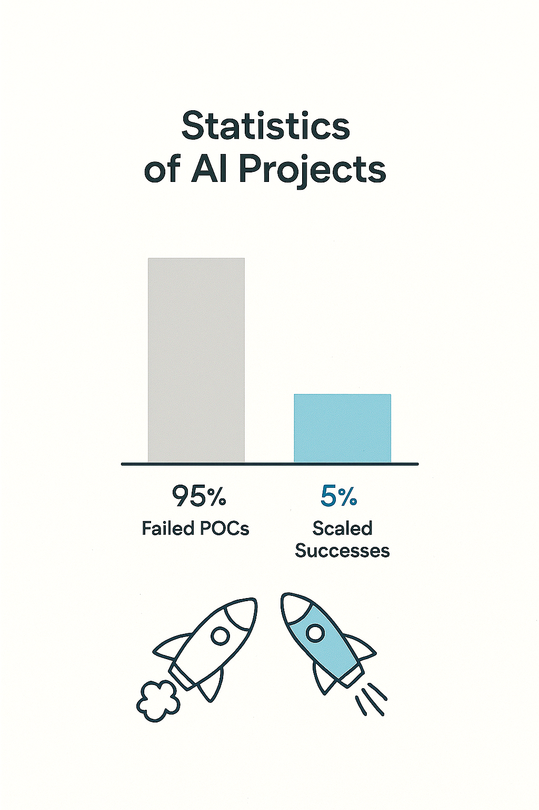
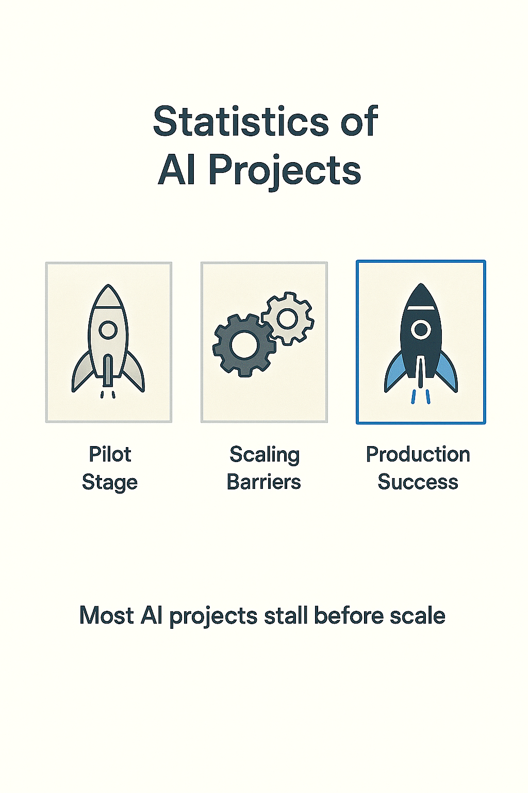
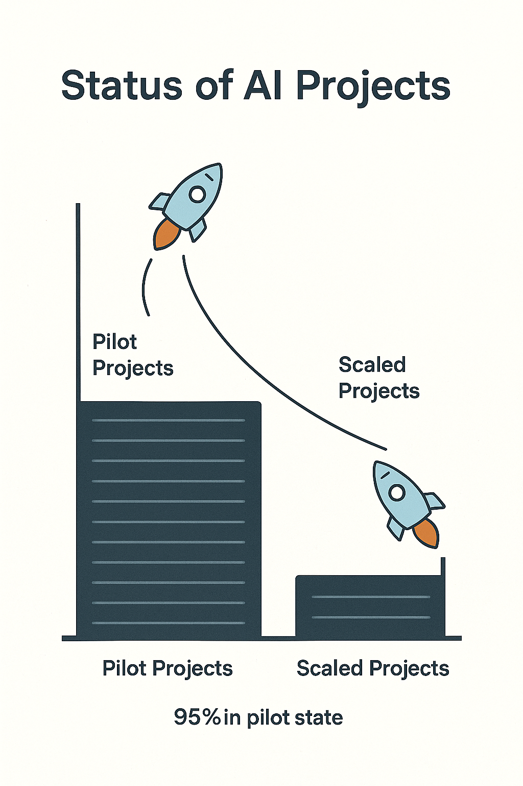
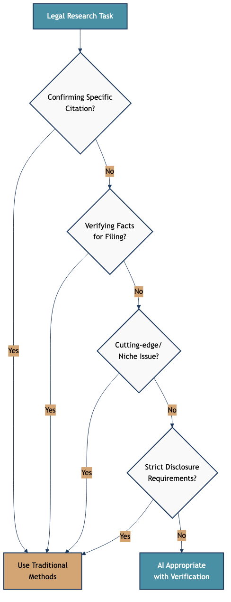

# The Statistics of AI Projects
# Why Most Pilots Never Scale

> Statistics about AI project success and failure rates provide realistic expectations. Understanding common failure modes helps you avoid repeating others' mistakes.
---

## Why most pilots never scale — and what that means for your organization

> This slide explores an important aspect of working with AI systems. Understanding this concept will help you make better decisions when evaluating and deploying AI in your work.
---

## Why We're Having This Conversation

AI promises are high.  
Reality is more complex.  
Understanding the numbers helps you plan with honesty, not hype

> This slide explores an important aspect of working with AI systems. Understanding this concept will help you make better decisions when evaluating and deploying AI in your work.
---

## The Central Stat

According to recent MIT research and industry surveys:  
Most AI projects (50–90%) don't move beyond proof of concept.  
Many that do launch fail to deliver expected value

> This slide explores an important aspect of working with AI systems. Understanding this concept will help you make better decisions when evaluating and deploying AI in your work.
---

## The MIT Study Context

MIT's Initiative on the Digital Economy tracked hundreds of AI projects across industries.  
Key finding: technical success does not equal business success

> This slide explores an important aspect of working with AI systems. Understanding this concept will help you make better decisions when evaluating and deploying AI in your work.
---

## Why So Many Projects Stall

Poor data quality.  
Misaligned expectations between technical and business teams.  
Lack of integration with existing workflows.  
No clear owner or budget for deployment.  
Culture resists adoption

> This slide explores an important aspect of working with AI systems. Understanding this concept will help you make better decisions when evaluating and deploying AI in your work.
---

## The POC Trap

Proof of concept shows it works.  
But production requires:  
Reliable data pipelines.  
Monitoring and governance.  
User training and change management.  
These are often unfunded or ignored

> This slide explores an important aspect of working with AI systems. Understanding this concept will help you make better decisions when evaluating and deploying AI in your work.
---

## Data Quality as the Bottleneck

AI needs clean, labeled, accessible data.  
Most organizations don't have this ready.  
Cleaning data takes longer than building the model.  
If you can't fix the data, the model won't scale

> This slide explores an important aspect of working with AI systems. Understanding this concept will help you make better decisions when evaluating and deploying AI in your work.
---

## The Integration Challenge

POCs run in isolation.  
Production AI must connect to real systems: CRM, ERP, databases, APIs.  
Integration complexity kills momentum

> Understanding challenges and limitations is as important as knowing capabilities. Realistic assessment of obstacles helps you plan appropriately and avoid nasty surprises.
---

## The People Problem

Technical teams build models.  
Business teams must use them.  
When those groups don't align, adoption fails.  
No one owns the outcome

> Understanding challenges and limitations is as important as knowing capabilities. Realistic assessment of obstacles helps you plan appropriately and avoid nasty surprises.
---

## Unrealistic Expectations

Leaders expect quick wins.  
AI takes time to deliver measurable ROI.  
When results lag, funding stops

> This slide explores an important aspect of working with AI systems. Understanding this concept will help you make better decisions when evaluating and deploying AI in your work.
---

## The Metrics Gap

POCs measure accuracy.  
Business measures revenue, cost, and time.  
If the model is accurate but slow or expensive, it fails

> Evaluation requires metrics aligned with actual goals. Technical metrics like accuracy matter less than business outcomes like user satisfaction or task completion.
---

## Culture and Resistance

People fear AI will replace them.  
Teams resist tools they don't trust or understand.  
Without buy-in, even good systems sit unused

> This slide explores an important aspect of working with AI systems. Understanding this concept will help you make better decisions when evaluating and deploying AI in your work.
---

## The Governance Gap

AI requires monitoring, updates, and audits.  
Many organizations lack processes for this.  
Systems drift. Trust erodes. Projects die

> AI governance establishes policies, processes, and oversight for responsible AI deployment. This includes defining acceptable use, review procedures, and accountability mechanisms.
---

## What the Data Shows

50–80% of AI pilots don't reach production.  
Of those that do, 30–50% underperform expectations.  
Only 10–20% deliver transformational value.  
These numbers are from industry surveys (Gartner, McKinsey, MIT)

> This slide explores an important aspect of working with AI systems. Understanding this concept will help you make better decisions when evaluating and deploying AI in your work.
---

## Why This Matters

The numbers are not a reason to avoid AI.  
They are a reason to prepare realistically.  
Success depends on process, not just technology

> This slide explores an important aspect of working with AI systems. Understanding this concept will help you make better decisions when evaluating and deploying AI in your work.
---

## What Successful Projects Do Differently

Start small with clear metrics.  
Align technical and business goals early.  
Invest in data infrastructure.  
Plan for deployment before building the model.  
Train and support users

> This slide explores an important aspect of working with AI systems. Understanding this concept will help you make better decisions when evaluating and deploying AI in your work.
---

## Lessons from Failures

Failure teaches more than success.  
Organizations that iterate learn faster.  
The goal is not avoiding mistakes — it's learning from them quickly

> This slide explores an important aspect of working with AI systems. Understanding this concept will help you make better decisions when evaluating and deploying AI in your work.
---

## The Space Is Changing

Tools improve.  
Best practices emerge.  
The next wave of AI projects will succeed more often.  
But only if teams apply what we now know

> This slide explores an important aspect of working with AI systems. Understanding this concept will help you make better decisions when evaluating and deploying AI in your work.
---

## No Easy Answers

AI is not plug-and-play.  
Every organization faces unique challenges.  
Success requires discipline, patience, and honesty

> This slide explores an important aspect of working with AI systems. Understanding this concept will help you make better decisions when evaluating and deploying AI in your work.
---

## Discussion Prompt

Think about your organization.  
Have you seen AI projects stall? Why?  
What would need to change to move from POC to production?

> This slide explores an important aspect of working with AI systems. Understanding this concept will help you make better decisions when evaluating and deploying AI in your work.
---

## Summary

Most AI projects don't scale.  
Data, integration, culture, and governance block progress.  
Understanding these patterns helps you design for success

> This slide explores an important aspect of working with AI systems. Understanding this concept will help you make better decisions when evaluating and deploying AI in your work.
---

## Key Takeaway

The statistics are not discouraging — they are clarifying.  
Success comes from planning for deployment, not just demonstration.  
The organizations that scale AI treat it as a system, not a science experiment

> This slide explores an important aspect of working with AI systems. Understanding this concept will help you make better decisions when evaluating and deploying AI in your work.