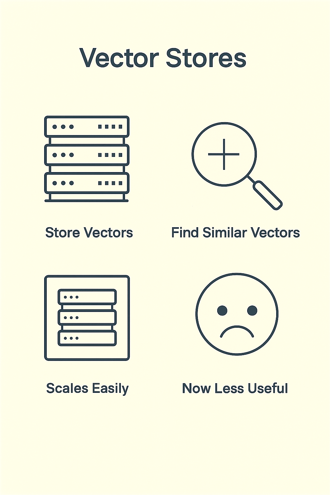

# Vector Stores
# Yesterday's Breakthrough, Today's Baseline

> Vector stores enable efficient similarity search across millions of embeddings. Yesterday's breakthrough has become today's standard infrastructure for semantic search and RAG systems.
---

## How embedding databases powered early AI — and why they now matter less

> Embeddings are mathematical representations of meaning that enable semantic search and similarity comparison. They've become foundational to modern AI systems, powering everything from search to recommendations.
---

## Why We're Talking About This

You will still hear names like Pinecone, Weaviate, and Milvus.  
They sound essential, but they're not what they used to be.  
This session explains what they did, why they were useful, and what replaced them

> This slide explores an important aspect of working with AI systems. Understanding this concept will help you make better decisions when evaluating and deploying AI in your work.
---

## The Original Problem

Large language models forget.  
They can't recall facts beyond their context window.  
Early developers needed a way to store embeddings and retrieve them when relevant

> Understanding challenges and limitations is as important as knowing capabilities. Realistic assessment of obstacles helps you plan appropriately and avoid nasty surprises.
---

## The Big Idea

Convert text into vectors.  
Store those vectors in a special database.  
When a user asks a question, find the most similar vectors, and feed that back into the model.  
This was called Retrieval-Augmented Generation (RAG)

> This slide explores an important aspect of working with AI systems. Understanding this concept will help you make better decisions when evaluating and deploying AI in your work.
---

## Why Regular Databases Couldn't Help

Relational databases match exact strings.  
They can't measure semantic similarity.  
We needed systems that could say "report" is close to "summary."  
That's what vector stores did

> This slide explores an important aspect of working with AI systems. Understanding this concept will help you make better decisions when evaluating and deploying AI in your work.
---

## What a Vector Store Does

Accept embeddings from a model.  
Index them in a high-dimensional space.  
Return the closest matches when queried.  
Allow metadata filtering and ranking.  
This made LLMs appear to have memory

> Vector stores enable efficient similarity search across millions of embeddings. Yesterday's breakthrough has become today's standard infrastructure for semantic search and RAG systems.
---

## The Players

Pinecone: hosted, easy to use, integrated with LangChain.  
Weaviate: open-source, schema-based, extensible.  
Milvus: performance-focused, scalable.  
They competed to become the "database of the AI era."

> This slide explores an important aspect of working with AI systems. Understanding this concept will help you make better decisions when evaluating and deploying AI in your work.
---

## The Early Stack

Prompt → Embedding → Vector Store → Retrieve → Model Output.  
This powered early chatbots and document search tools.  
It was fast, simple, and flexible — for a time

> This slide explores an important aspect of working with AI systems. Understanding this concept will help you make better decisions when evaluating and deploying AI in your work.
---

## Why It Worked

Vector stores solved context limits.  
They made retrieval accurate and interpretable.  
They enabled private knowledge bases without retraining the model

> This slide explores an important aspect of working with AI systems. Understanding this concept will help you make better decisions when evaluating and deploying AI in your work.
---

## What Changed

Models grew smarter.  
Context windows expanded from 4K to 1M tokens.  
Now the model can hold the entire knowledge base in context.  
RAG still helps, but less often needs a separate store

> This slide explores an important aspect of working with AI systems. Understanding this concept will help you make better decisions when evaluating and deploying AI in your work.
---

## Another Shift: The Rise of Protocols

Tools like Model Context Protocol (MCP) replaced manual retrieval.  
Instead of a developer wiring Pinecone to LangChain, MCP lets the model ask for context directly through a secure channel.  
Less plumbing. More automation

> This slide explores an important aspect of working with AI systems. Understanding this concept will help you make better decisions when evaluating and deploying AI in your work.
---

## Integrated Retrieval

Modern platforms (OpenAI, Anthropic, Databricks, Google) now offer built-in vector search.  
You no longer need a separate system to run semantic search.  
The capability lives inside the model or the data platform

> This slide explores an important aspect of working with AI systems. Understanding this concept will help you make better decisions when evaluating and deploying AI in your work.
---

## What's Happening to Pinecone

Still useful in specialized settings:  
When latency and control matter.  
When you need hybrid (text + metadata) search.  
But for most users, built-in retrieval is simpler, faster, and cheaper

> This slide explores an important aspect of working with AI systems. Understanding this concept will help you make better decisions when evaluating and deploying AI in your work.
---

## The Concept Remains

The idea of similarity search still underpins AI memory.  
The difference is where it lives.  
Now, it's embedded inside the model rather than managed by developers

> This slide explores an important aspect of working with AI systems. Understanding this concept will help you make better decisions when evaluating and deploying AI in your work.
---

## Analogy

Vector stores were like external hard drives.  
They expanded your storage when your laptop was small.  
Now laptops come with terabytes built in — still useful, but not mandatory

> This slide explores an important aspect of working with AI systems. Understanding this concept will help you make better decisions when evaluating and deploying AI in your work.
---

## Modern Replacements

| Purpose | Old Tool | Modern Equivalent |  
|---------|----------|-------------------|  
| Semantic search | Pinecone | Native vector search (Databricks, Snowflake, Postgres) |  
| Context retrieval | LangChain + Pinecone | MCP + integrated RAG |  
| Knowledge graphs | Weaviate schemas | Model-based reasoning with structured prompts |

> This slide explores an important aspect of working with AI systems. Understanding this concept will help you make better decisions when evaluating and deploying AI in your work.
---

## What to Remember

Vector stores solved retrieval when models were small.  
They shaped the RAG pattern we still use conceptually.  
They are now built in, not bolted on

> This slide explores an important aspect of working with AI systems. Understanding this concept will help you make better decisions when evaluating and deploying AI in your work.
---

## Why This Knowledge Still Matters

When you hear "vector store," you'll know it means semantic search.  
You'll know it came from a time when models couldn't remember.  
You'll know the idea still matters, even if the tool doesn't

> This slide explores an important aspect of working with AI systems. Understanding this concept will help you make better decisions when evaluating and deploying AI in your work.
---

## Discussion Prompt

Think about your workplace data.  
Where would semantic retrieval still be valuable?  
Where would it now be simpler to use a model with a long context instead?

> This slide explores an important aspect of working with AI systems. Understanding this concept will help you make better decisions when evaluating and deploying AI in your work.
---

## Closing

Vector stores helped AI remember.  
They made RAG possible.  
Now they are absorbed into the infrastructure — invisible, but still fundamental

> This slide explores an important aspect of working with AI systems. Understanding this concept will help you make better decisions when evaluating and deploying AI in your work.