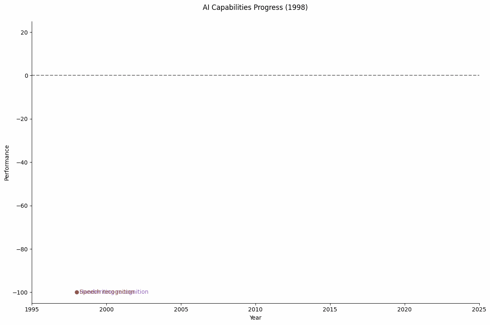

# Week 1
# Introduction to Artificial Intelligence

---

## Course Overview

This course builds AI literacy through applied examples  
You will learn core models, ethical use, and how to deploy small applications

---

## What is Artificial Intelligence

AI is any system that performs tasks requiring human reasoning, learning, or perception  
We use data to create models that generalize beyond what they have seen

---

## A Short History

1956: The Dartmouth Conference named the field  
1980s: Expert systems dominated  
2010s: Deep learning redefined progress  
2020s: Generative models reshaped content creation

---

## Why AI Matters

AI drives automation, analysis, and prediction  
Every domain—from healthcare to logistics—depends on data-driven decisions

---

## The AI Workflow

Data → Model → Output  
Each link must be sound  
Garbage in produces garbage out

---

## Categories of AI

Supervised learning: labeled examples  
Unsupervised learning: pattern discovery  
Reinforcement learning: reward feedback

---

## Tools of the Trade

Python, Jupyter, Databricks, Hugging Face, and open APIs  
These will support all labs and projects

---

## Common Myths

AI is not magic  
It does not "think."  
It extends human reasoning through statistics and pattern recognition

---

## Course Projects

You will form teams and build an AI solution to a real business problem  
Final deliverables include a short paper, web app, and recorded demo

---

## Key Takeaways

AI is a tool, not a mystery  
Understanding data and limits is as important as building models

