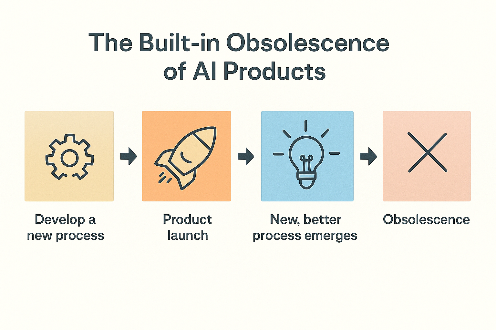
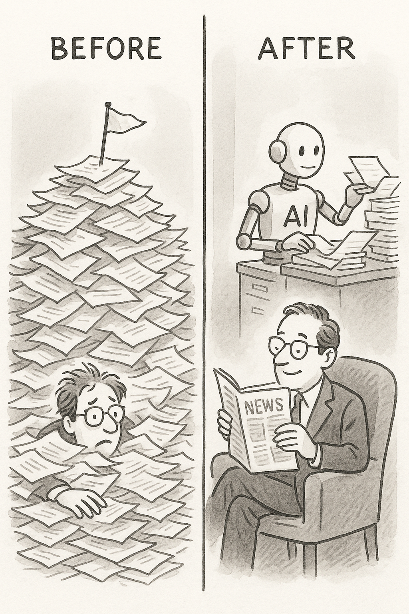
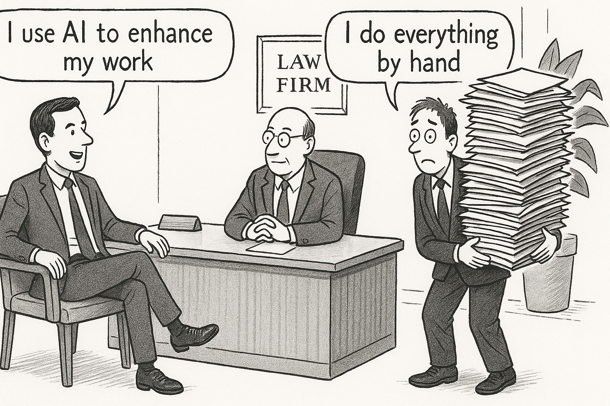

# Week 11
# AI Change Management

> This slide explores an important concept in applied AI. Understanding this material will help you make better decisions when evaluating opportunities and challenges in your field.
---

## Bringing people along when work changes

> This slide explores an important concept in applied AI. Understanding this material will help you make better decisions when evaluating opportunities and challenges in your field.
---

## The Core Idea

AI succeeds when people use it.  
Change management ensures adoption, not resistance

> This slide explores an important concept in applied AI. Understanding this material will help you make better decisions when evaluating opportunities and challenges in your field.
---

## The Human Side

AI alters workflows, not just tools.  
People need clarity, purpose, and trust before they accept change

> This slide explores an important concept in applied AI. Understanding this material will help you make better decisions when evaluating opportunities and challenges in your field.
---

## Communication First

Explain the "why."  
What problem are we solving?  
What stays the same?  
What improves for the user?  
Without context, AI feels imposed — not helpful

> This slide explores an important concept in applied AI. Understanding this material will help you make better decisions when evaluating opportunities and challenges in your field.
---

## Roles and Impact

Show where AI fits:  
Repetitive tasks → automation.  
Analytical work → augmentation.  
Decision making → collaboration.  
AI should make people stronger, not smaller

> This slide explores an important concept in applied AI. Understanding this material will help you make better decisions when evaluating opportunities and challenges in your field.
---

## Training and Confidence

Practical exposure builds trust.  
Hands-on sessions.  
Shadow workflows.  
Clear escalation when AI fails.  
Confidence grows through experience, not memos

> This slide explores an important concept in applied AI. Understanding this material will help you make better decisions when evaluating opportunities and challenges in your field.
---

## Governance and Feedback

Change doesn't stop at launch.  
Users must be able to raise issues, flag errors, and influence retraining

> AI governance establishes policies, processes, oversight mechanisms, and accountability for responsible deployment. This includes defining acceptable use, review procedures, incident response, and continuous monitoring.
---

## Leadership Role

Leaders must model curiosity, not fear.  
They frame AI as a partner, not a threat

> This slide explores an important concept in applied AI. Understanding this material will help you make better decisions when evaluating opportunities and challenges in your field.
---

## Metrics for Adoption

Usage rate.  
Error overrides.  
Employee satisfaction.  
Business outcomes.  
Adoption is a data problem, too

> Evaluation requires metrics aligned with actual goals beyond just technical accuracy. Consider business outcomes, user satisfaction, fairness across groups, and long-term impacts when assessing success.
---

## Summary

AI transformation is human transformation.  
Communicate clearly.  
Train thoughtfully.  
Adapt continuously

> This slide explores an important concept in applied AI. Understanding this material will help you make better decisions when evaluating opportunities and challenges in your field.