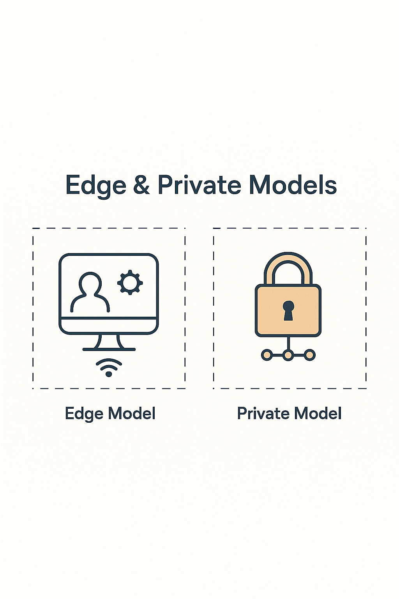

# Week 16
# Edge and Private Models

> This slide explores an important concept in applied AI. Understanding this material will help you make better decisions when evaluating opportunities and challenges in your field.
---

## AI that runs near the data for speed, privacy, and control

> This slide explores an important concept in applied AI. Understanding this material will help you make better decisions when evaluating opportunities and challenges in your field.
---

## The Core Idea

Instead of sending data to the cloud, send the model to the data.  
Edge AI and private models protect privacy and reduce latency

> This slide explores an important concept in applied AI. Understanding this material will help you make better decisions when evaluating opportunities and challenges in your field.
---

## Edge AI

Runs on devices or gateways near data sources.  
Examples:  
Turbine sensor anomaly detection.  
Drone image classification.  
Retail camera analytics.  
Benefits: speed and autonomy when connectivity is limited

> This slide explores an important concept in applied AI. Understanding this material will help you make better decisions when evaluating opportunities and challenges in your field.
---

## Private Models

Deployed inside a company's environment or VPC.  
No data leaves the organization.  
Used for sensitive domains like finance, health, or defense

> This slide explores an important concept in applied AI. Understanding this material will help you make better decisions when evaluating opportunities and challenges in your field.
---

## Why They Matter

Lower data transfer costs.  
Meet regulatory requirements.  
Enable real-time decisions in remote locations

> Understanding why concepts matter helps you apply them appropriately. This context prevents cargo-cult adoption of practices that don't fit your situation.
---

## Trade-Offs

Edge devices have limited compute.  
Private models require maintenance and security patches.  
Balancing performance and protection is key

> This slide explores an important concept in applied AI. Understanding this material will help you make better decisions when evaluating opportunities and challenges in your field.
---

## Example Architecture

Sensor → Edge Model → Secure Gateway → Private LLM → Analytics Dashboard

> Concrete examples illustrate how abstract concepts apply in practice. Studying both successes and failures reveals patterns worth emulating or avoiding.
---

## Summary

Edge and private models keep AI close to the action and under your control.  
They turn AI into infrastructure, not a service you borrow

> This slide explores an important concept in applied AI. Understanding this material will help you make better decisions when evaluating opportunities and challenges in your field.