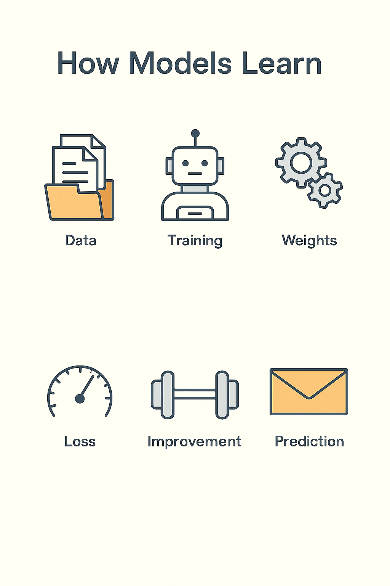
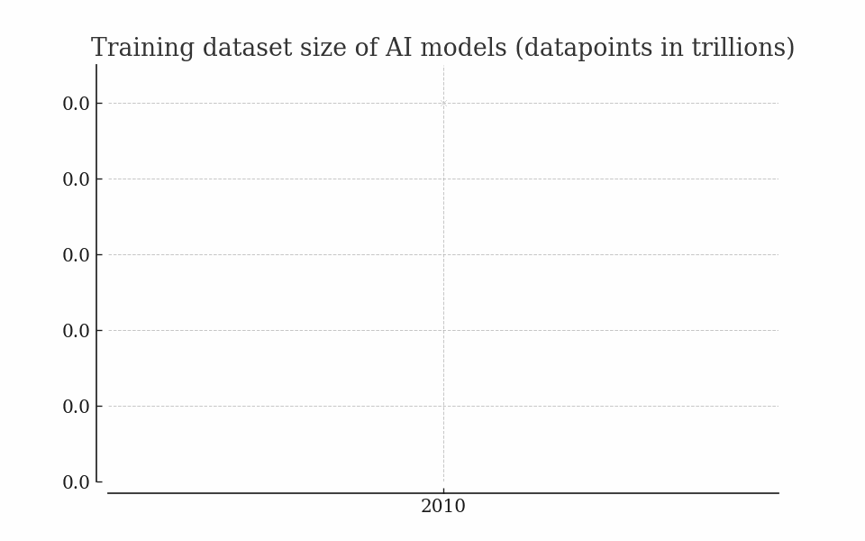

# Week 1
# How Models Learn

> This slide explores an important concept in applied AI. Understanding this material will help you make better decisions when evaluating opportunities and challenges in your field.
---

## Understanding weights, bias, and pattern recognition without math

> AI ethics addresses fairness, accountability, transparency, privacy, and societal impact. Bias can enter at every stage from data collection through deployment, requiring active mitigation throughout the lifecycle.
---

## The Big Idea

Models learn by adjusting numbers that change how they react to input.  
They don't memorize answers. They learn patterns from examples

> This slide explores an important concept in applied AI. Understanding this material will help you make better decisions when evaluating opportunities and challenges in your field.
---

## From Data to Decisions

Input → Internal Calculation → Output  
Example: "Good morning" → predicts next word "sunshine."  
Every word shifts weights a little closer to better accuracy

> This slide explores an important concept in applied AI. Understanding this material will help you make better decisions when evaluating opportunities and challenges in your field.
---

## Weights and Bias

Weights decide how strong each connection is.  
Bias gives a baseline push toward certain outputs.  
Together, they shape how a model interprets new input

> AI ethics addresses fairness, accountability, transparency, privacy, and societal impact. Bias can enter at every stage from data collection through deployment, requiring active mitigation throughout the lifecycle.
---

## The Feedback Loop

Prediction → Compare to Correct Answer → Adjust.  
This process repeats millions of times.  
That's training — not memorization, but correction

> This slide explores an important concept in applied AI. Understanding this material will help you make better decisions when evaluating opportunities and challenges in your field.
---

## The Role of Data

Data quality sets the limits.  
Clean, balanced data helps the model generalize.  
Noisy or biased data teaches bad habits

> This slide explores an important concept in applied AI. Understanding this material will help you make better decisions when evaluating opportunities and challenges in your field.
---

## Example: Cat vs. Dog

The model sees 1000 cats and 1000 dogs.  
At first, it guesses at random.  
Over time, it learns to associate "whiskers," "ears," "fur" with "cat."  
Weights shift toward better predictions

> Concrete examples illustrate how abstract concepts apply in practice. Studying both successes and failures reveals patterns worth emulating or avoiding.
---

## Loss Function

The loss is the gap between what the model predicted and what it should have predicted.  
Training is about shrinking that gap

> This slide explores an important concept in applied AI. Understanding this material will help you make better decisions when evaluating opportunities and challenges in your field.
---

## Gradient Descent (No Math)

Imagine rolling a ball down a hill until it stops in the lowest valley.  
That valley is the point where the model makes the fewest mistakes.  
That's how it "learns."

> This slide explores an important concept in applied AI. Understanding this material will help you make better decisions when evaluating opportunities and challenges in your field.
---

## Model Capacity

A small model has few knobs to turn.  
A large model has billions.  
More knobs = more nuance, but also more noise

> This slide explores an important concept in applied AI. Understanding this material will help you make better decisions when evaluating opportunities and challenges in your field.
---

## Generalization

A good model doesn't memorize the training data.  
It learns patterns it can reuse on new data.  
That's intelligence, not memory

> This slide explores an important concept in applied AI. Understanding this material will help you make better decisions when evaluating opportunities and challenges in your field.
---

## Summary

Models learn by adjusting weights to reduce error.  
They rely on good data and many small corrections.  
Learning is slow, but scalable — and the foundation of all AI

> This slide explores an important concept in applied AI. Understanding this material will help you make better decisions when evaluating opportunities and challenges in your field.