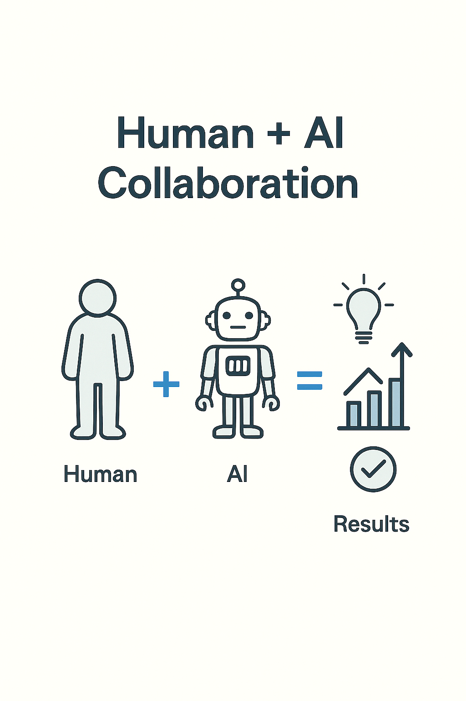

# Week 14
# Human + AI Collaboration

> This slide explores an important concept in applied AI. Understanding this material will help you make better decisions when evaluating opportunities and challenges in your field.
---

## Amplifying judgment, not replacing it

> This slide explores an important concept in applied AI. Understanding this material will help you make better decisions when evaluating opportunities and challenges in your field.
---

## The Core Idea

AI extends what people can do — faster decisions, broader insight.  
The best systems combine machine precision and human sense-making

> This slide explores an important concept in applied AI. Understanding this material will help you make better decisions when evaluating opportunities and challenges in your field.
---

## Complementary Strengths

Humans: context, ethics, creativity.  
AI: scale, speed, pattern detection.  
Collaboration = human goals + machine capability

> This slide explores an important concept in applied AI. Understanding this material will help you make better decisions when evaluating opportunities and challenges in your field.
---

## Common Patterns

Assistive: AI suggests, human decides.  
Supervised: human trains, AI executes.  
Collaborative: both adapt in real time

> This slide explores an important concept in applied AI. Understanding this material will help you make better decisions when evaluating opportunities and challenges in your field.
---

## Example

Doctor uses AI scan analysis for diagnosis.  
AI detects early patterns  
Doctor applies context and experience
Together, accuracy improves

> Concrete examples illustrate how abstract concepts apply in practice. Studying both successes and failures reveals patterns worth emulating or avoiding.
---

## Design for Partnership

Interfaces must make AI visible and explainable.  
Good collaboration design includes:  
Confidence scores.  
"Why" explanations.  
Human override

> This slide explores an important concept in applied AI. Understanding this material will help you make better decisions when evaluating opportunities and challenges in your field.
---

## Risks of Over-Reliance

Automation bias: trusting outputs blindly.  
Always keep the final judgment human

> Risk assessment identifies what could go wrong, how likely it is, and how serious the consequences would be. Prioritize mitigations for your highest-impact risks.
---

## Success Measures

Productivity increase.  
Decision quality.  
User satisfaction.  
Reduction in repetitive tasks

> This slide explores an important concept in applied AI. Understanding this material will help you make better decisions when evaluating opportunities and challenges in your field.
---

## Summary

Human + AI = hybrid intelligence.  
Machines scale thought  
People give meaning

> This slide explores an important concept in applied AI. Understanding this material will help you make better decisions when evaluating opportunities and challenges in your field.