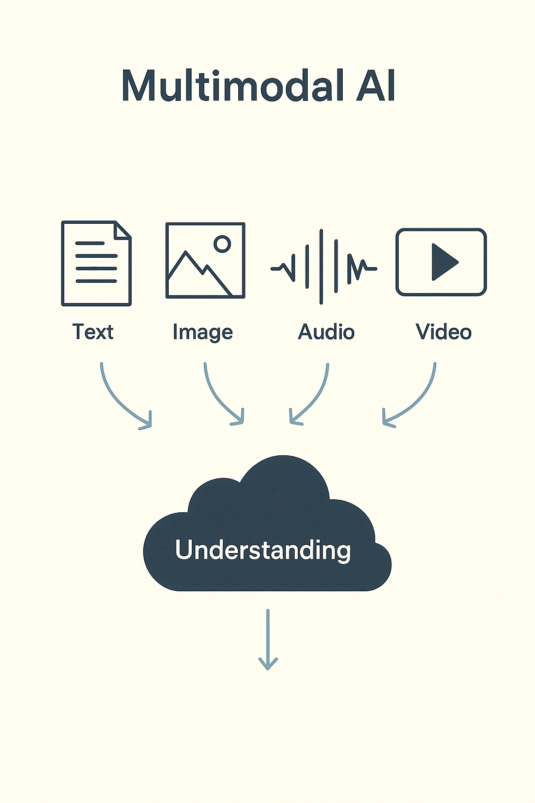

# Week 17
# Multimodal AI

> This slide explores an important concept in applied AI. Understanding this material will help you make better decisions when evaluating opportunities and challenges in your field.
---

## AI that combines senses — seeing, reading, and hearing — to understand the world

> This slide explores an important concept in applied AI. Understanding this material will help you make better decisions when evaluating opportunities and challenges in your field.
---

## The Core Idea

Traditional AI works on one data type: text, image, or sound  
Multimodal AI combines them  
It forms a shared understanding across many formats

> This slide explores an important concept in applied AI. Understanding this material will help you make better decisions when evaluating opportunities and challenges in your field.
---

## Why It Matters

Humans interpret the world through many senses  
Multimodal AI mirrors that — understanding context, emotion, and intent  
Example: reading text, seeing a picture, and linking both

> Understanding why concepts matter helps you apply them appropriately. This context prevents cargo-cult adoption of practices that don't fit your situation.
---

## Real Examples

ChatGPT + Vision: describe a chart, read handwriting, summarize a slide  
Gemini & Claude: mix text and image for reasoning  
Tesla Autopilot: merges video, lidar, and telemetry for driving

> Concrete examples illustrate how abstract concepts apply in practice. Studying both successes and failures reveals patterns worth emulating or avoiding.
---

## How It Works

Each data type becomes an embedding in a shared vector space  
Text, sound, and image all map to the same numeric space  
That's how AI "knows" a dog photo, sound, and word all connect

> This slide explores an important concept in applied AI. Understanding this material will help you make better decisions when evaluating opportunities and challenges in your field.
---

## Core Models

CLIP (OpenAI): links images and text  
Whisper: transcribes and aligns speech  
Flamingo / Gemini: generate responses across text and vision

> This slide explores an important concept in applied AI. Understanding this material will help you make better decisions when evaluating opportunities and challenges in your field.
---

## Challenges

Synchronizing timing between modes (audio vs video)  
Scaling data volume  
Avoiding bias from dominant modalities

> Understanding challenges and limitations is as important as knowing capabilities. Realistic assessment helps you plan appropriately and avoid nasty surprises.
---

## Business Value

Quality control from image + text logs  
Call center analytics from audio + sentiment  
Media search by combining words and visuals

> This slide explores an important concept in applied AI. Understanding this material will help you make better decisions when evaluating opportunities and challenges in your field.
---

## The Future

Next frontier: grounding — linking AI's perception to real-world context  
Soon, one model will describe, act, and predict seamlessly across all inputs

> This slide explores an important concept in applied AI. Understanding this material will help you make better decisions when evaluating opportunities and challenges in your field.
---

## Summary

Multimodal AI merges perception and language  
It sees, listens, and understands in one frame of thought

> This slide explores an important concept in applied AI. Understanding this material will help you make better decisions when evaluating opportunities and challenges in your field.