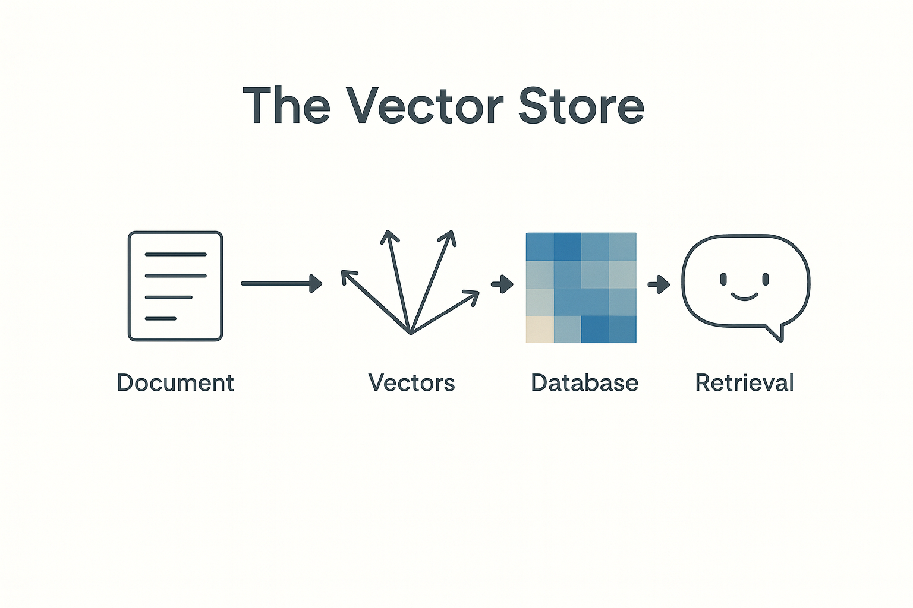

# Week 5
# Retrieval-Augmented Generation (RAG)

> This slide explores an important concept in applied AI. Understanding this material will help you make better decisions when evaluating opportunities and challenges in your field.
---

## How models use outside knowledge without retraining

> Edge and private models run locally rather than calling cloud APIs, addressing latency requirements, privacy constraints, and connectivity limitations. These deployments trade some capability for greater control.
---

## The Problem

Large models know a lot but not everything  
Their knowledge ends at training time  
They can't see your files or recent data

> Understanding challenges and limitations is as important as knowing capabilities. Realistic assessment helps you plan appropriately and avoid nasty surprises.
---

## The Idea

RAG adds a lookup step before generation  
When you ask a question, the system searches for relevant documents first, then feeds them to the model

> This slide explores an important concept in applied AI. Understanding this material will help you make better decisions when evaluating opportunities and challenges in your field.
---

## How It Works

Embed the question  
Search a vector store for similar chunks  
Insert those chunks into the prompt  
Generate the answer

> This slide explores an important concept in applied AI. Understanding this material will help you make better decisions when evaluating opportunities and challenges in your field.
---

## Example

User asks: "What is our refund policy?"  
RAG finds the policy PDF, extracts the text, and adds it to the prompt  
The model answers with accurate, current information

> Concrete examples illustrate how abstract concepts apply in practice. Studying both successes and failures reveals patterns worth emulating or avoiding.
---

## Why It Matters

No need to fine-tune for every update  
Answers stay current as data changes  
Cheaper and faster than model training

> Understanding why concepts matter helps you apply them appropriately. This context prevents cargo-cult adoption of practices that don't fit your situation.
---

## Data Flow Summary

User Query → Embedding → Vector Search → Retrieved Context → Model → Answer

> This slide explores an important concept in applied AI. Understanding this material will help you make better decisions when evaluating opportunities and challenges in your field.
---

## Key Components

Vector Store: stores document embeddings  
Retriever: finds matches  
Generator: creates the response  
Pipeline: connects them into one system

> This slide explores an important concept in applied AI. Understanding this material will help you make better decisions when evaluating opportunities and challenges in your field.
---

## Applications

Enterprise Q&A  
Knowledge assistants  
Legal and policy reference bots  
Internal support chatbots

> This slide explores an important concept in applied AI. Understanding this material will help you make better decisions when evaluating opportunities and challenges in your field.
---

## Limitations

If retrieval fails, output is wrong  
Bad chunks confuse the model  
Prompt length and token cost still matter

> Understanding challenges and limitations is as important as knowing capabilities. Realistic assessment helps you plan appropriately and avoid nasty surprises.
---

## Summary

RAG connects AI to real data  
It retrieves first, then reasons  
That's how AI stays relevant after training

> This slide explores an important concept in applied AI. Understanding this material will help you make better decisions when evaluating opportunities and challenges in your field.